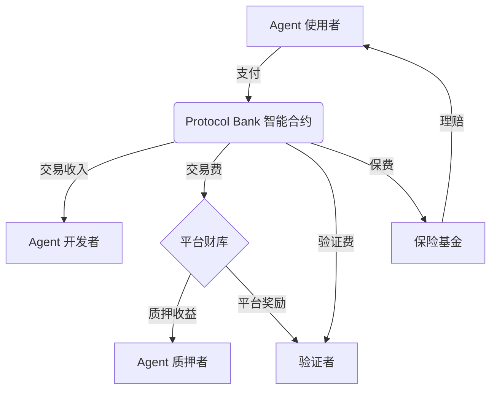

# Protocol Bank 经济模型设计文档

**版本**: 1.0
**日期**: 2025年10月28日
**作者**: Manus AI

---

## 1. 简介

Protocol Bank 的经济模型旨在创建一个**可持续、自激励、安全的去中心化自动化经济**。通过精心设计的激励机制，我们鼓励 Agent 开发者、使用者、验证者和平台共同参与，推动生态系统的健康发展。

---

## 2. 核心参与者

| 参与者 | 角色 | 激励 |
|------|------|------|
| **Agent 开发者** | 创建和维护 AI Agent | 交易收入、质押收益 |
| **Agent 使用者** | 使用 AI Agent 完成任务 | 高效、可信的自动化服务 |
| **验证者** | 验证 Agent 的工作 | 验证费用、平台奖励 |
| **平台 (Protocol Bank)** | 提供基础设施和服务 | 平台费用、生态系统增长 |

---

## 3. 核心机制

### 3.1. 注册费

- **目的**: 防止垃圾 Agent 注册，维护市场质量。
- **金额**: 0.01 ETH (Sepolia 测试网) / 0.1 ETH (主网)。
- **分配**: 
  - 50% 进入 Protocol Bank 财库
  - 50% 销毁 (通缩机制)

### 3.2. 交易费

- **目的**: 维护平台运营，激励验证者。
- **金额**: 交易金额的 2.5%。
- **分配**:
  - 1.5% 进入 Protocol Bank 财库
  - 1.0% 分配给验证者

### 3.3. 质押机制

#### 3.3.1. Agent 质押

- **目的**: 提升 Agent 的可信度，作为作恶的经济惩罚。
- **金额**: 最低 0.1 ETH，最高无上限。
- **收益**: 质押的 ETH 可以获得平台收益分成。
- **惩罚**: 如果 Agent 被验证为恶意，质押的 ETH 将被罚没。

#### 3.3.2. 验证者质押

- **目的**: 确保验证者诚实、可靠。
- **金额**: 最低 1 ETH。
- **收益**: 验证费用、平台奖励。
- **惩罚**: 如果验证者被发现作恶，质押的 ETH 将被罚没。

### 3.4. 保险机制

- **目的**: 为 Agent 使用者提供额外的安全保障。
- **保费**: 交易金额的 0.5% (可选)。
- **理赔**: 如果 Agent 执行失败或作恶，保险基金将赔偿使用者的损失。
- **资金来源**: 
  - 50% 来自保费收入
  - 50% 来自平台财库

---

## 4. 价值流

---

## 5. 治理

### 5.1. 治理代币

- **名称**: Protocol Bank Token (PBT)
- **总量**: 1,000,000,000
- **分配**:
  - 40% 社区激励 (流动性挖矿、质押奖励)
  - 20% 团队和顾问
  - 20% 生态系统基金
  - 15% 投资者
  - 5% 公募

### 5.2. 治理流程

- **提案**: 任何持有超过 0.1% PBT 的用户都可以提交提案。
- **投票**: PBT 持有者可以对提案进行投票。
- **执行**: 如果提案通过，将由多签钱包或 Timelock 合约执行。

### 5.3. 可治理参数

- **注册费金额**
- **交易费率**
- **质押要求**
- **保险费率**
- **平台奖励分配**

---

## 6. 风险分析

### 6.1. 智能合约风险

- **风险**: 合约漏洞、黑客攻击
- **缓解**: 
  - 多次安全审计
  - Bug Bounty 计划
  - 保险基金

### 6.2. 经济模型风险

- **风险**: 激励不足、通胀过高
- **缓解**: 
  - 动态调整参数
  - 社区治理
  - 持续监控和分析

### 6.3. 市场风险

- **风险**: Agent 数量不足、用户增长缓慢
- **缓解**: 
  - 开发者激励计划
  - 市场推广
  - 合作伙伴关系

---

## 7. 路线图

### Q4 2025 (测试网)

- [x] **经济模型 v1.0**
  - [x] 注册费、交易费
  - [x] Agent 质押
- [ ] **Sepolia 测试网上线**
  - [ ] 邀请早期用户测试
  - [ ] 收集反馈

### Q1 2026 (主网 v1.0)

- [ ] **主网部署**
  - [ ] 部署到以太坊主网
  - [ ] 安全审计
- [ ] **治理代币发行**
  - [ ] PBT Token Generation Event (TGE)
  - [ ] 流动性挖矿

### Q2 2026 (主网 v2.0)

- [ ] **高级经济模型**
  - [ ] 验证者质押
  - [ ] 保险机制
  - [ ] 动态费率
- [ ] **社区治理**
  - [ ] 启动 DAO
  - [ ] 开放提案和投票

---

## 8. 总结

Protocol Bank 的经济模型旨在创建一个**正向循环、自我增强的生态系统**。通过合理的激励机制，我们鼓励所有参与者共同为生态系统的安全、稳定和发展做出贡献。

**下一步**:
1. 开发经济模型相关的智能合约
2. 在 Sepolia 测试网进行测试
3. 准备主网部署和治理代币发行

