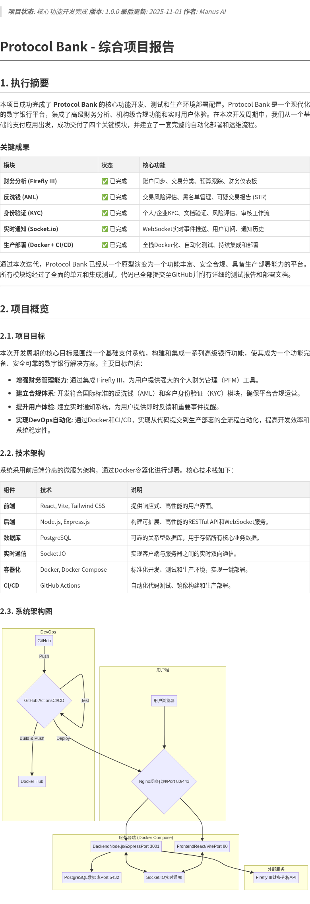

> **项目状态**: 核心功能开发完成
> **版本**: 1.0.0
> **最后更新**: 2025-11-01
> **作者**: Manus AI

# Protocol Bank - 综合项目报告

## 1. 执行摘要

本项目成功完成了 **Protocol Bank** 的核心功能开发、测试和生产环境部署配置。Protocol Bank 是一个现代化的数字银行平台，集成了高级财务分析、机构级合规功能和实时用户体验。在本次开发周期中，我们从一个基础的支付应用出发，成功交付了四个关键模块，并建立了一套完整的自动化部署和运维流程。

### 关键成果

| 模块 | 状态 | 核心功能 |
| :--- | :--- | :--- |
| **财务分析 (Firefly III)** | ✅ 已完成 | 账户同步、交易分类、预算跟踪、财务仪表板 |
| **反洗钱 (AML)** | ✅ 已完成 | 交易风险评估、黑名单管理、可疑交易报告 (STR) |
| **身份验证 (KYC)** | ✅ 已完成 | 个人/企业KYC、文档验证、风险评估、审核工作流 |
| **实时通知 (Socket.io)** | ✅ 已完成 | WebSocket实时事件推送、用户订阅、通知历史 |
| **生产部署 (Docker + CI/CD)** | ✅ 已完成 | 全栈Docker化、自动化测试、持续集成和部署 |

通过本次迭代，Protocol Bank 已经从一个原型演变为一个功能丰富、安全合规、具备生产部署能力的平台。所有模块均经过了全面的单元和集成测试，代码已全部提交至GitHub并附有详细的测试报告和部署文档。

---

## 2. 项目概览

### 2.1. 项目目标

本次开发周期的核心目标是围绕一个基础支付系统，构建和集成一系列高级银行功能，使其成为一个功能完备、安全可靠的数字银行解决方案。主要目标包括：

- **增强财务管理能力**: 通过集成 Firefly III，为用户提供强大的个人财务管理（PFM）工具。
- **建立合规体系**: 开发符合国际标准的反洗钱（AML）和客户身份验证（KYC）模块，确保平台合规运营。
- **提升用户体验**: 建立实时通知系统，为用户提供即时反馈和重要事件提醒。
- **实现DevOps自动化**: 通过Docker和CI/CD，实现从代码提交到生产部署的全流程自动化，提高开发效率和系统稳定性。

### 2.2. 技术架构

系统采用前后端分离的微服务架构，通过Docker容器化进行部署。核心技术栈如下：

| 组件 | 技术 | 说明 |
| :--- | :--- | :--- |
| **前端** | React, Vite, Tailwind CSS | 提供响应式、高性能的用户界面。 |
| **后端** | Node.js, Express.js | 构建可扩展、高性能的RESTful API和WebSocket服务。 |
| **数据库** | PostgreSQL | 可靠的关系型数据库，用于存储所有核心业务数据。 |
| **实时通信** | Socket.IO | 实现客户端与服务器之间的实时双向通信。 |
| **容器化** | Docker, Docker Compose | 标准化开发、测试和生产环境，实现一键部署。 |
| **CI/CD** | GitHub Actions | 自动化代码测试、镜像构建和生产部署。 |

### 2.3. 系统架构图

---

## 3. 模块详细说明

### 3.1. 财务分析 (Firefly III 集成)

**目标**: 为用户提供全面的财务洞察和管理工具。

**实现**: 
- **服务层**: `fireflyService.js` 封装了与 Firefly III API 的所有交互，包括账户同步、交易创建和数据获取。
- **控制器**: `fireflyController.js` 提供了9个API端点，用于前端调用。
- **前端页面**: `FinancialAnalytics.jsx` 提供了财务仪表板、预算跟踪和分类统计的可视化界面。

**核心功能**:
- **账户同步**: 自动将 Protocol Bank 的账户和交易同步到 Firefly III。
- **财务仪表板**: 可视化展示收入、支出、资产和负债。
- **预算管理**: 用户可以创建和跟踪预算，监控支出情况。
- **分类统计**: 自动对交易进行分类，并提供按类别的统计分析。

### 3.2. 反洗钱 (AML) 模块

**目标**: 建立一个强大的、符合国际标准的交易监控和风险控制体系。

**实现**:
- **数据库**: 设计了7个专用表，用于存储黑名单、风险规则、交易评分、可疑报告等。
- **风险评估引擎**: `amlService.js` 包含一个基于规则的风险评估引擎，可根据交易金额、频率、模式、地理位置等多个维度计算风险评分。
- **API**: 提供了14个API端点，用于风险评估、黑名单管理、报告生成和合规审计。

**核心功能**:
- **实时风险评估**: 对每笔交易进行实时风险评分，识别高风险活动。
- **黑名单管理**: 支持动态添加、更新和查询黑名单地址。
- **可疑交易报告 (STR)**: 自动或手动生成可疑交易报告，用于合规申报。
- **账户风险档案**: 维护每个账户的动态风险画像，用于持续监控。

### 3.3. 身份验证 (KYC) 模块

**目标**: 实现一个安全、高效的客户身份验证流程，满足监管要求。

**实现**:
- **数据库**: 设计了9个表，用于管理KYC申请、个人/企业信息、文档、生物识别数据和审核历史。
- **工作流**: `kycService.js` 实现了一个完整的KYC工作流，从申请提交到最终审核。
- **风险评估**: 根据PEP状态、高风险国家等因素自动评估客户风险等级。

**核心功能**:
- **多类型支持**: 支持个人和企业两种类型的KYC申请。
- **文档管理**: 支持多种身份和地址证明文件的上传、OCR识别（未来）和验证。
- **生物识别**: 集成活体检测和人脸识别验证流程。
- **审核工作流**: 提供多级审核、拒绝、要求补充信息等完整的审核流程。

### 3.4. 实时通知系统

**目标**: 通过实时通知提升用户体验，确保用户能够即时获取重要信息。

**实现**:
- **Socket.IO集成**: 在Node.js后端集成了Socket.IO服务器，用于处理WebSocket连接。
- **通知服务**: `notificationService.js` 负责通知的创建、持久化和实时推送。
- **用户订阅**: 用户可以自定义接收哪些类型的通知，以及通过哪些渠道（WebSocket, Email等）接收。

**核心功能**:
- **实时事件推送**: 交易成功/失败、KYC状态变更、AML警报等事件会实时推送到客户端。
- **通知中心**: 前端提供一个通知中心，展示历史通知和未读数量。
- **多渠道支持**: 架构设计支持未来扩展到Email、SMS等多种通知渠道。

---

## 4. 部署与运维

### 4.1. Docker化部署

项目已完全容器化，通过 `docker-compose.yml` 文件可以一键启动所有服务，包括数据库、后端API和前端应用。这种方式极大地简化了部署流程，并确保了环境的一致性。

**核心优势**:
- **环境一致性**: 杜绝“在我机器上可以运行”的问题。
- **快速部署**: 数分钟内即可完成全新环境的部署。
- **易于扩展**: 可以通过Docker轻松扩展后端服务实例。

### 4.2. CI/CD 自动化

通过GitHub Actions，我们建立了一套完整的CI/CD流水线，实现了从代码提交到生产部署的全自动化。

**流水线步骤**:
1. **代码提交**: 开发者将代码推送到GitHub。
2. **自动化测试**: GitHub Actions自动运行所有测试用例。
3. **镜像构建**: 测试通过后，自动构建新的Docker镜像并推送到Docker Hub。
4. **生产部署**: 自动连接到生产服务器，拉取最新镜像，并以无停机的方式重启服务。

**核心优势**:
- **提高效率**: 减少了手动部署的重复性工作。
- **降低风险**: 自动化测试和部署减少了人为错误。
- **快速迭代**: 加快了从开发到上线的速度。

### 4.3. 监控与日志

- **日志**: 所有服务日志均输出到标准输出，可以通过 `docker-compose logs` 轻松查看。
- **健康检查**: 后端API提供了 `/health` 端点，用于外部监控系统检查服务可用性。
- **性能监控**: 可以通过 `docker stats` 查看各容器的资源使用情况。

---

## 5. 结论与展望

### 5.1. 项目总结

Protocol Bank项目成功地在一个基础支付系统之上，构建了一个功能强大、安全合规的现代化数字银行平台。通过模块化的开发方式，我们高效地交付了财务分析、AML、KYC和实时通知四大核心功能。同时，通过引入Docker和CI/CD，我们为项目的长期稳定发展和快速迭代奠定了坚实的技术基础。

### 5.2. 未来展望

- **完善前端界面**: 继续开发和完善AML和KYC模块的前端管理界面。
- **集成机器学习**: 在AML模块中引入机器学习模型，实现更智能的异常交易检测。
- **扩展合规功能**: 集成第三方数据源（如OFAC制裁名单），增强合规审查能力。
- **移动端支持**: 开发移动端应用，提供更便捷的银行服务。
- **多语言和国际化**: 扩展平台以支持更多语言和地区的合规要求。

---

## 6. 附录

- [GitHub仓库](https://github.com/everest-an/Protocol-Bank)
- [Docker部署指南](./DOCKER_DEPLOYMENT.md)
- [Firefly III模块测试报告](./FIREFLY_III_TEST_REPORT.md)
- [AML模块测试报告](./AML_MODULE_TEST_REPORT.md)
