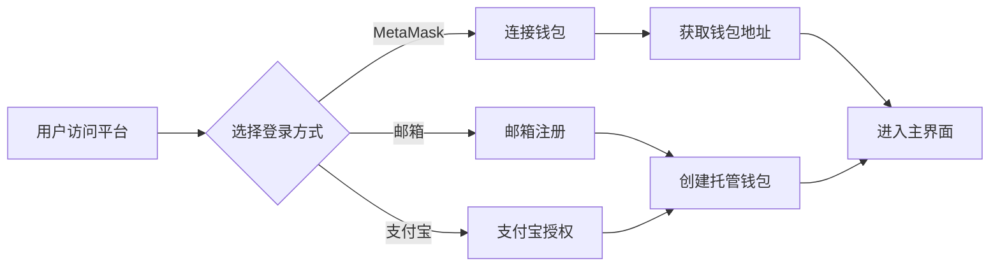

# Protocol Bank 系统架构与业务流程设计

## 1. 核心业务模式

### 1.1 资金托管模式

Protocol Bank 采用**智能合约托管**模式，而非传统的中心化账户模式：

```
用户 A (充值 USDT) → 智能合约托管池 → 用户 B (按时间释放)
```

**关键特点**：
- ✅ **去中心化**：资金由智能合约管理，平台无法挪用
- ✅ **透明**：所有交易记录在区块链上可查
- ✅ **自动化**：通过智能合约自动执行支付和结算
- ✅ **无需信任**：用户不需要信任平台，只需信任代码

### 1.2 与你描述的模式对比

| 维度 | 你描述的模式 | Protocol Bank 当前设计 | 建议方案 |
|------|-------------|---------------------|---------|
| 资金流向 | 用户 → 平台总账户 → 记账 → 结算给收款方 | 用户 → 智能合约 → 直接给收款方 | **混合模式**：支持两种方案 |
| 记账方式 | 平台数据库记账 | 区块链自动记账 | 链上+链下双记账 |
| 结算方式 | 平台定时批量结算 | 实时流式支付或定时自动结算 | 支持多种结算模式 |
| 平台角色 | 资金托管方 | 技术服务提供方 | 可选托管服务 |

## 2. 完整业务流程设计

### 2.1 用户注册与身份验证



**实现状态**：
- ✅ MetaMask 连接已实现
- ⚠️ 邮箱和支付宝登录需要后端支持（当前为占位符）

### 2.2 资金充值流程

#### 方案 A：直接充值到智能合约（当前实现）

```
1. 用户授权 USDT 给智能合约
2. 用户调用充值函数
3. USDT 转入智能合约
4. 合约记录用户余额
5. 前端显示可用余额
```

#### 方案 B：充值到平台总账户（你提出的需求）

```
1. 用户转账 USDT 到平台指定地址
2. 平台监听链上转账事件
3. 后端数据库记录用户充值
4. 为用户账户增加余额（链下记账）
5. 前端显示可用余额
```

**建议**：实现**混合模式**，让企业用户可以选择：
- **托管模式**：充值到平台，由平台统一管理和结算（适合大额、频繁交易）
- **自主模式**：直接使用智能合约，用户完全控制资金（适合小额、偶尔交易）

### 2.3 发起支付流程

#### 2.3.1 实时流支付（Stream Payment）

```
用户 A 操作：
1. 选择收款方（钱包地址或供应商）
2. 设置支付金额和时长（如：1000 USDT，30天）
3. 授权智能合约扣款
4. 创建支付流

智能合约：
5. 锁定用户 A 的 1000 USDT
6. 记录支付流参数（起始时间、结束时间、流速）
7. 触发 StreamCreated 事件

用户 B 操作：
8. 随时查看可提取金额（按时间线性增长）
9. 调用提取函数
10. 收到 USDT 到钱包

网络自动：
11. 无需定时清算，用户 B 随时可提取当前已解锁的金额
```

**公式**：
```
可提取金额 = 总金额 × (当前时间 - 开始时间) / (结束时间 - 开始时间)
```

#### 2.3.2 批量支付（Batch Payment）

```
用户操作：
1. 上传 CSV 文件或手动添加多个收款方
   格式：地址, 金额, 备注
2. 预览支付列表和总金额
3. 确认并授权

智能合约：
4. 循环处理每个收款方
5. 批量转账 USDT
6. 记录每笔交易

优化：
7. 使用批量转账合约减少 gas 费用
```

#### 2.3.3 定时支付（Scheduled Payment）

```
用户操作：
1. 选择模板或自定义工作流
   - 每月发工资
   - 价格触发支付
   - AI 条件支付
2. 配置触发条件和支付参数
3. 授权并激活

执行方式：
方案 A - Chainlink Automation：
4. Chainlink 节点定时检查条件
5. 条件满足时自动调用合约
6. 执行支付

方案 B - 后端定时任务：
4. 后端定时检查条件
5. 条件满足时调用合约
6. 执行支付
```

#### 2.3.4 托管支付（Stake Payment）

```
用户 A（付款方）：
1. 创建托管支付
2. 设置里程碑和条件
3. 锁定资金到合约

用户 B（收款方）：
4. 查看托管条件
5. 完成工作并提交证明

验证方（VC/LP/第三方）：
6. 审核工作成果
7. 批准或拒绝

智能合约：
8. 根据验证结果释放资金
9. 如拒绝，退款给付款方
```

### 2.4 资金结算流程

#### 当前实现（去中心化）：

```
- 无需平台结算
- 用户随时提取到自己钱包
- 智能合约自动计算可用余额
```

#### 你需要的模式（中心化托管）：

```
定时任务（每天/每周）：
1. 后端扫描所有待结算订单
2. 计算每个用户应得金额
3. 批量调用智能合约转账
4. 从平台总账户转给各收款方
5. 更新数据库结算状态
6. 发送结算通知
```

## 3. 数据流架构

### 3.1 链上数据（智能合约）

```
StreamPayment 合约：
- streams: mapping(uint256 => Stream)  // 所有支付流
- userStreams: mapping(address => uint256[])  // 用户的支付流ID列表

Stream 结构：
- sender: 发送方地址
- recipient: 接收方地址  
- tokenAddress: USDT 合约地址
- deposit: 总金额
- startTime: 开始时间
- stopTime: 结束时间
- remainingBalance: 剩余余额
- ratePerSecond: 每秒释放速率
```

### 3.2 链下数据（后端数据库 - 可选）

```
users 表：
- address: 钱包地址
- email: 邮箱（可选）
- balance: 托管余额（如果使用托管模式）
- created_at: 注册时间

suppliers 表：
- id: 供应商ID
- name: 名称
- address: 钱包地址
- category: 分类
- total_received: 累计收款

transactions 表：
- tx_hash: 交易哈希
- from: 发送方
- to: 接收方
- amount: 金额
- type: 类型（stream/batch/scheduled）
- status: 状态
- timestamp: 时间戳
```

## 4. 技术架构图

```
┌─────────────────────────────────────────────────────────────┐
│                        前端 (React)                          │
│  ┌──────────┐  ┌──────────┐  ┌──────────┐  ┌──────────┐   │
│  │ Payments │  │Suppliers │  │Analytics │  │Agent Mkt │   │
│  └──────────┘  └──────────┘  └──────────┘  └──────────┘   │
└─────────────────────────────────────────────────────────────┘
                          │
                          ↓
┌─────────────────────────────────────────────────────────────┐
│                    Web3 Provider (ethers.js)                 │
│                    连接 MetaMask / WalletConnect             │
└─────────────────────────────────────────────────────────────┘
                          │
        ┌─────────────────┼─────────────────┐
        ↓                 ↓                 ↓
┌──────────────┐  ┌──────────────┐  ┌──────────────┐
│ StreamPayment│  │BatchPayment  │  │ScheduledPay  │
│   合约       │  │   合约       │  │   合约       │
└──────────────┘  └──────────────┘  └──────────────┘
        │                 │                 │
        └─────────────────┼─────────────────┘
                          ↓
                  ┌──────────────┐
                  │  USDT 合约   │
                  │  (ERC-20)    │
                  └──────────────┘
                          │
                          ↓
                ┌──────────────────┐
                │  Sepolia 测试网  │
                └──────────────────┘

可选后端服务（如需托管模式）：
┌─────────────────────────────────────────────────────────────┐
│                    后端 API (Node.js)                        │
│  ┌──────────┐  ┌──────────┐  ┌──────────┐  ┌──────────┐   │
│  │用户管理  │  │充值监听  │  │定时结算  │  │数据分析  │   │
│  └──────────┘  └──────────┘  └──────────┘  └──────────┘   │
└─────────────────────────────────────────────────────────────┘
                          │
                          ↓
                  ┌──────────────┐
                  │  PostgreSQL  │
                  │   数据库     │
                  └──────────────┘
```

## 5. 功能路由表

| 路由 | 页面 | 主要功能 | 需要钱包 | 实现状态 |
|------|------|---------|---------|---------|
| `/` 或 `/#/payments` | Flow Payment | 查看支付网络拓扑、创建流支付 | 创建时需要 | ✅ UI完成，待集成合约 |
| `/#/stake` | Flow Payment (Stake) | 创建托管支付、里程碑管理 | 是 | ❌ 待开发 |
| `/#/batch` | Batch Payment | 批量支付、CSV导入 | 是 | ✅ UI完成，待集成合约 |
| `/#/schedule` | Scheduled Payment | 定时支付、工作流编排 | 是 | ✅ UI完成，待开发后端 |
| `/#/suppliers` | Suppliers | 供应商管理、注册 | 注册时需要 | ✅ 基本完成 |
| `/#/analytics` | Analytics | 财务分析、报表导出 | 否 | ✅ UI完成，需真实数据 |
| `/#/agent-market` | Agent Market | AI代理市场、ERC-8004 | 注册代理需要 | ✅ UI完成，待集成合约 |

## 6. 开发优先级建议

### Phase 1: 核心支付功能（1-2天）
1. ✅ 部署 StreamPayment 合约到 Sepolia
2. ✅ 部署测试 USDT 合约
3. ✅ 集成前端与合约（创建流、提取、查询）
4. ✅ MetaMask 连接和交易测试

### Phase 2: 批量和定时支付（1天）
5. ⚠️ 开发 BatchPayment 合约
6. ⚠️ 集成批量支付前端
7. ⚠️ 实现 Scheduled Payment 后端定时任务

### Phase 3: 托管和代理市场（1-2天）
8. ⚠️ 开发 StakePayment 合约
9. ⚠️ 修复 Flow Payment (Stake) 页面
10. ⚠️ 集成 ERC-8004 Agent 合约

### Phase 4: 完善和优化（1天）
11. ⚠️ Suppliers 页面区块链集成
12. ⚠️ Analytics 真实数据展示
13. ⚠️ 错误处理和用户体验优化
14. ⚠️ 部署到生产环境

## 7. 关键问题需要确认

### 7.1 资金托管模式选择

**选项 A**：完全去中心化（当前实现）
- ✅ 优点：安全、透明、无需信任
- ❌ 缺点：用户需要懂区块链、gas费用

**选项 B**：平台托管（你描述的模式）
- ✅ 优点：用户体验好、可以法币充值
- ❌ 缺点：需要牌照、资金风险、中心化

**选项 C**：混合模式（推荐）
- ✅ 企业用户可选托管模式
- ✅ 个人用户使用去中心化模式
- ✅ 灵活性最高

**你的选择是？**

### 7.2 USDT 使用方式

- **Sepolia 测试网**：使用我们自己部署的 MockUSDT（用于测试）
- **主网**：使用真实的 USDT 合约（需要真实资金）

测试阶段使用 MockUSDT，我会给你的测试钱包铸造足够的测试币。

### 7.3 定时支付的实现方式

- **选项 A**：Chainlink Automation（去中心化，但需要支付 LINK 代币）
- **选项 B**：后端定时任务（中心化，但免费且灵活）

建议先用选项 B，后期可升级到选项 A。

## 8. 下一步行动

请确认：
1. ✅ 资金托管模式：去中心化 / 托管 / 混合？
2. ✅ 是否需要后端 API 和数据库？
3. ✅ 定时支付使用后端定时任务还是 Chainlink？
4. ✅ 开发优先级是否按照上述 Phase 1-4 进行？

确认后我将立即开始开发！
