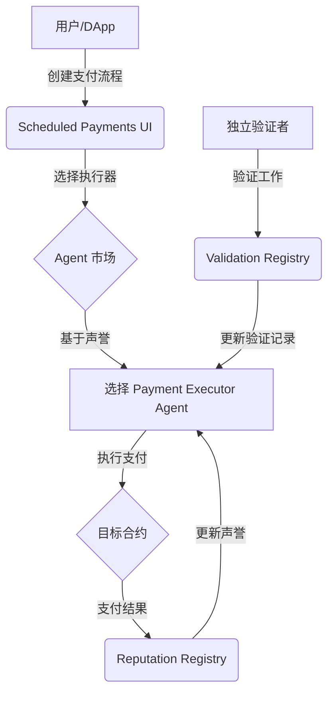

# Protocol Bank 白皮书更新草稿

**版本**: 2.0
**日期**: 2025年10月28日
**作者**: EverestAn

---

## 摘要

Protocol Bank 正在通过集成 **ERC-8004 Trustless Agents** 标准，彻底改变自动化支付的未来。本次更新引入了一个去中心化的 AI Agent 信任层，使 Protocol Bank 能够支持无需预先信任的 AI-to-AI 支付，特别是在 Scheduled Payments 功能中。

通过链上声誉和验证系统，我们为自动化支付执行器（AI Agent）创建了一个开放、透明、可信的市场，解决了自动化金融协作中的核心信任问题。

---

## 1. ERC-8004：去中心化 AI Agent 信任层

ERC-8004 是一个革命性的以太坊标准，旨在为 AI Agent 之间的交互建立一个无需预先信任的信任层 [1]。它通过三个核心的链上注册表实现：

### 1.1. Identity Registry (身份注册表)

- **基于 ERC-721 的 Agent 身份**：每个 AI Agent 都是一个 NFT，拥有唯一的身份标识（Agent ID）。
- **可转移的所有权**：Agent NFT 可以像其他 NFT 一样被转移、交易或用作抵押品。
- **丰富的元数据**：支持链上（键值对）和链下（IPFS）元数据，详细描述 Agent 的能力、端点和支持的服务。

### 1.2. Reputation Registry (声誉注册表)

- **去中心化的反馈系统**：任何人都可以为 Agent 提供反馈，评分范围为 0-100。
- **防篡改的声誉**：所有反馈都记录在链上，无法被篡改或删除（只能撤销）。
- **标签化和过滤**：支持使用 `bytes32` 标签对反馈进行分类，例如按服务类型（支付、验证）、结果（成功、失败）等。
- **EIP-712 签名授权**：通过签名授权机制，确保只有经过授权的用户才能提交反馈，防止垃圾信息。

### 1.3. Validation Registry (验证注册表)

- **独立的第三方验证**：Agent 的工作可以由独立的验证者进行验证。
- **链上证据和结果**：验证请求、证据（IPFS 链接）和验证结果都记录在链上。
- **灵活的验证模型**：支持多种验证模型，从简单的手动验证到复杂的自动化验证。

---

## 2. 与 Scheduled Payments 的集成

Scheduled Payments 是 Protocol Bank 的核心功能之一，允许用户创建自动化的支付流程。通过集成 ERC-8004，我们将其升级为 **Trustless Scheduled Payments**。

### 2.1. 新的架构

### 2.2. 核心优势

| 功能 | 之前 | 集成 ERC-8004 后 |
| :--- | :--- | :--- |
| **执行器** | 中心化或需要预先信任 | 去中心化的 Agent 市场 |
| **信任** | 依赖平台或合约 | 依赖链上声誉和验证 |
| **透明度** | 有限 | 完全透明，所有记录在链上 |
| **互操作性** | 困难 | 任何符合标准的 Agent 都可以加入 |
| **AI-to-AI 支付** | 不支持 | **核心支持**，AI Agent 可以互相信任并协作 |

### 2.3. AI-to-AI 支付场景

> 假设一个供应链金融场景：
> 1. **供应商 Agent**（ERC-8004 Agent）在货物交付后，自动向 **采购商 Agent**（ERC-8004 Agent）请求付款。
> 2. **采购商 Agent** 验证货物交付（通过链上 Oracle），然后从 **声誉注册表** 查询 **供应商 Agent** 的声誉。
> 3. 如果声誉良好，**采购商 Agent** 自动授权支付。
> 4. 支付完成后，**采购商 Agent** 为 **供应商 Agent** 提供正面反馈，进一步提升其声誉。
> 5. 整个过程无需人工干预，完全基于链上信任。

---

## 3. 技术实现

### 3.1. 合约和工具

- **ERC-8004 合约**：已部署在多个测试网（Sepolia, Base Sepolia, Optimism Sepolia 等）。
- **IPFS**：用于存储链下元数据、反馈详情和验证证据。
- **Ethers.js**：用于与智能合约交互。
- **React Hooks**：创建了 `useAgentRegistry`, `useReputation`, `useValidation` 等 Hook，简化了集成。

### 3.2. 用户流程

1. **注册 Agent**：用户可以通过 Protocol Bank 的 UI 注册自己的支付执行器 Agent。
2. **选择 Agent**：在创建 Scheduled Payments 流程时，用户可以从 Agent 市场中选择一个高声誉的 Agent。
3. **提供反馈**：支付完成后，用户可以为 Agent 提供反馈，影响其声誉。
4. **请求验证**：对于关键支付，用户可以请求独立的验证者进行验证。

---

## 4. 未来展望

通过集成 ERC-8004，Protocol Bank 不仅仅是一个支付应用，更是一个**去中心化的自动化经济平台**。

未来我们将：
- **扩展到更多领域**：将 ERC-8004 应用于资产管理、数据分析、去中心化治理等。
- **构建 Agent SDK**：提供工具包，帮助开发者轻松创建和注册自己的 AI Agent。
- **探索 AI Agent 经济模型**：研究 Agent 之间的服务定价、质押、保险等经济模型。

我们相信，基于 ERC-8004 的 Trustless Agents 将是 Web3 和 AI 融合的下一个重要里程碑。

---

## 参考文献

[1] ERC-8004: Trustless Agents. Ethereum Improvement Proposals. [https://eips.ethereum.org/EIPS/eip-8004](https://eips.ethereum.org/EIPS/eip-8004)

[2] ChaosChain/trustless-agents-erc-ri. GitHub. [https://github.com/ChaosChain/trustless-agents-erc-ri](https://github.com/ChaosChain/trustless-agents-erc-ri)

