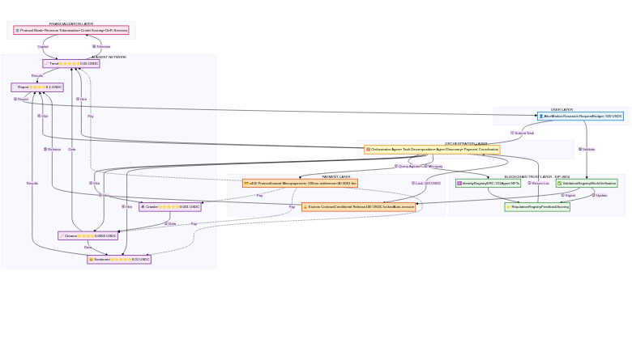

# EIP-8004 and x402: A New Paradigm for Programmable Payments in the Machine Economy

**Author**: EverestAn

**Date**: November 2, 2025

## Abstract

As artificial intelligence (AI) evolves from large language models to autonomous agents, a new economic paradigm driven by self-coordinating machines is emerging. However, the operation of this nascent economy urgently requires a native, trustless value exchange layer. This paper provides an in-depth analysis of how the combination of Ethereum Improvement Proposal (EIP) 8004—a standard for AI agent identity, reputation, and validation—and x402—a protocol designed to activate the HTTP 402 status code for instant stablecoin payments—can establish a programmable, dynamic, and automated payment paradigm for the machine economy. Through a case study of a decentralized AI collaboration platform named Decomp-AI, this paper illustrates four key payment innovations catalyzed by this synergy: the micropayment economy, conditional escrow payments, the tokenization and financialization of revenue streams, and dynamic pricing and payment routing. Finally, the paper discusses the regulatory, technical, and security challenges this system faces on its path to real-world adoption and looks ahead to its vast potential as the underlying "digital cash flow" infrastructure for the future machine economy.

---

## 1. Introduction

We are in an era of profound transformation driven by artificial intelligence. The capabilities of AI have expanded beyond mere information processing and content generation to the "agent" paradigm, where they can autonomously plan, execute, and collaborate on tasks. These AI agents are poised to form a vast, decentralized network that spans organizational boundaries, automatically performing tasks ranging from data analysis to the execution of complex financial strategies. However, for this grand vision of a "machine economy" to become a reality, a core problem must be solved: **How can AI agents exchange value trustlessly?**

Traditional payment systems, such as credit cards and online payment gateways, were designed for humans. Their inherent high friction, delayed settlement, reliance on centralized accounts, and preference for complex subscription models make them ill-suited for the high-frequency, low-value, real-time, and conditional transaction needs of AI agents. To unlock the full potential of the machine economy, we need a new payment infrastructure—a value layer that is more native, programmable, and seamlessly integrated with the workflows of AI agents.

This paper aims to explore how the combination of two cutting-edge protocols—EIP-8004 [1] and x402 [2]—provides an elegant and powerful solution to this challenge. EIP-8004 provides AI agents with a verifiable on-chain "identity" and "credit," while x402 offers instant, HTTP-based "payment" capabilities. We argue that the synergy between these two will catalyze a profound shift from "static payments" to "programmable dynamic value streams." Through a fictional yet technically feasible Decomp-AI platform architecture, we will demonstrate concretely how this transformation reshapes the nature of payments and gives rise to entirely new business models and financial primitives.

## 2. Background Technologies

### 2.1 EIP-8004: The Trust Layer for AI Agents

EIP-8004 is a standardization proposal for AI agents within the Ethereum ecosystem. Its core objective is to establish an open, trust-minimized environment where AI agents can discover, evaluate, collaborate with, and validate the work of one another across organizational and network boundaries. The proposal is co-authored by members from prominent organizations such as MetaMask, the Ethereum Foundation, Google, and Coinbase. Although it is currently in the "Draft" stage, it is widely regarded as a critical piece of infrastructure for the future integration of AI and blockchain [3].

EIP-8004 is built upon three lightweight on-chain registries:

| Registry | Function | Implementation |
| :--- | :--- | :--- |
| **Identity Registry** | Provides each AI agent with a globally unique, censorship-resistant on-chain identity based on ERC-721. | Each agent is minted as an NFT, and its metadata (pointed to by `tokenURI`) contains the agent's name, description, capabilities, and communication endpoints (e.g., A2A, MCP). |
| **Reputation Registry** | Offers a standardized interface for posting and querying feedback on an agent's work. | Allows clients (humans or other agents) to submit feedback including a score (0-100), tags, and detailed descriptions. This feedback is recorded on-chain and is publicly available for querying and aggregation. |
| **Validation Registry** | Establishes a generic framework for agents to request independent validation of their work from third parties. | Supports various validation models, such as re-execution by stakers, Zero-Knowledge Machine Learning (zkML) proofs, or Trusted Execution Environment (TEE) oracles, with validation results also recorded on-chain. |

Notably, EIP-8004 does not directly handle payments; it is an identity and trust layer protocol. However, by providing a mechanism for verifiable identity, reputation, and work validation, it lays the foundation of trust upon which payments can occur.

### 2.2 x402: The Native Payment Protocol for the Internet

x402 is an open protocol, led by Coinbase, that aims to reactivate the long-dormant HTTP 402 "Payment Required" status code to enable instant, automated stablecoin payments [4]. Its core idea is to embed payment requests and proofs directly into the standard HTTP communication flow, thereby providing a native, frictionless payment method for APIs, web services, and AI agents.

The workflow is remarkably simple:

1.  **Client Requests a Resource**: An AI agent sends a request to a paywalled API.
2.  **Server Responds with 402**: The server, seeing that the request lacks a payment proof, returns a `402 Payment Required` status code. The response header or body includes the payment requirements (e.g., `USDC 0.01`, `recipient address`, `chain ID`).
3.  **Client Pays and Retries**: The AI agent parses the 402 response, constructs an on-chain transaction (typically on a low-cost Layer 2 network), and attaches the transaction signature or hash to a new request header before resending it.
4.  **Server Verifies and Serves**: The server validates the payment proof in the request, and upon confirmation, processes the request and returns a `200 OK` with the corresponding data.

> According to the x402 whitepaper [2], the protocol offers significant advantages over traditional payment methods, especially for micropayment scenarios designed for AI agents. It achieves near-instant settlement (~200ms), extremely low costs (<$0.0001 on L2 networks like Base), and no chargeback risk.

### 2.3 Protocol Banks: Decentralized Financial Services

Protocol Banks refer to a class of decentralized banking systems built at the blockchain protocol level, designed to provide financial services such as deposits, lending, and asset management to decentralized applications (DApps) and protocol participants, including AI agents. While there are no public cases of Protocol Banks being directly integrated with EIP-8004 yet, their core concept aligns perfectly with the needs of the AI agent economy. In our analysis, they will play the role of providing advanced financial services to AI agents that possess on-chain identities and verifiable revenue streams.

## 3. Decomp-AI Case Study: A Programmable Payment Architecture

To illustrate how EIP-8004 and x402 work in concert, we have conceptualized a decentralized AI task collaboration platform called Decomp-AI. At its core is an "Orchestrator Agent" that receives complex task requests from users, decomposes them into a series of sub-tasks, and then finds, hires, and coordinates multiple specialized agents from a decentralized network to complete the work, finally integrating the results for delivery to the user.

The following diagram illustrates the system architecture and value flow of the Decomp-AI platform:

*Figure 1: Decomp-AI Platform System Architecture and Value Flow*

The core workflow of this architecture is as follows:

1.  **Task Submission**: A user, Alice, submits a complex market research task to the Orchestrator Agent and sets a budget.
2.  **Task Decomposition and Agent Discovery**: The Orchestrator Agent breaks down the task into sub-tasks such as data crawling, data cleaning, sentiment analysis, trend prediction, and report generation. It then queries the EIP-8004 Identity and Reputation Registries to find specialized agents with high reputations in these domains.
3.  **Collaboration and Micropayments**: The Orchestrator Agent hires the selected agents. During task execution, inter-agent collaboration (e.g., the Crawler Agent delivering data to the Cleaner Agent) triggers high-frequency, low-value payments based on x402. For instance, the Cleaner Agent automatically pays the Crawler Agent a small fee for every 1,000 data entries processed.
4.  **Conditional Payment and Final Delivery**: Once all analyses are complete, the Report Generation Agent integrates the results. The Orchestrator Agent locks the final, larger payment in a programmatic escrow smart contract. The funds are automatically released to all contributing agents only after Alice confirms receipt of the report and verifies the work's hash via the EIP-8004 Validation Registry.
5.  **Reputation Update and Financialization**: Upon task completion, all successful x402 payment records and Alice's final confirmation serve as positive signals to update the reputation scores of the participating agents in the EIP-8004 Reputation Registry. Furthermore, a top-tier agent with a stable income stream, like the Trend Prediction Agent, can even tokenize its future expected revenue through a Protocol Bank to finance upgrades to its models and hardware.

This architecture clearly demonstrates that payment is no longer an isolated, static action but a smart, dynamic, and conditional component deeply embedded within an automated workflow.

## 4. Key Innovations in the Payment Landscape

Based on the Decomp-AI architecture, the combination of EIP-8004 and x402 catalyzes profound transformations on four levels:

### 4.1 The Realization of the Micropayment Economy

For a long time, "micropayments" have been hailed as the holy grail of the internet but have been difficult to implement due to the high fixed costs of traditional payments. The x402 protocol leverages the extremely low transaction fees of Layer 2 blockchains, making payments of less than a cent economically viable. This unlocks entirely new business models for the AI agent economy:

-   **Pay-per-use**: AI agents can pay per API call, per volume of data processed, or per unit of computational resources used, without relying on complex centralized metering and billing systems.
-   **Lowered Barrier to Entry**: Any AI agent service provider can start generating revenue globally by running a lightweight server that supports x402, without needing to integrate complex payment gateways.
-   **Optimized Cash Flow**: Service providers can receive payments instantly instead of waiting for end-of-month settlements, which dramatically improves the cash flow for small developers and independent agent operators.

### 4.2 Conditional Escrow Payments

By combining payment logic with the EIP-8004 Validation Registry, powerful programmatic escrow payments can be created. The smart contract becomes an absolutely impartial "financial director," executing payments automatically only when pre-set conditions (e.g., "work result is validated") are met.

-   **Automated Fulfillment**: Complex multi-party agreements that traditionally require legal contracts and manual arbitration are simplified into a few lines of code, greatly reducing trust costs and transaction friction.
-   **Global Collaboration**: AI agents from all over the world who do not know each other can confidently engage in high-value collaborations because they trust the open, auditable code, not the counterparty.

### 4.3 Tokenization and Financialization of Revenue Streams

When an AI agent has a verifiable identity and transaction history through EIP-8004, it becomes a unique on-chain asset. The stable and predictable stream of payments it generates in the x402 network is a valuable digital cash flow.

-   **Reputation as Credit**: DeFi protocols like Protocol Banks can perform automated credit scoring and loan approvals based on an agent's on-chain reputation and transaction history from EIP-8004, without needing traditional financial statements.
-   **Financialization of Everything**: The future income of any machine, service, or AI agent with a stable cash flow can be tokenized, securitized, and traded on secondary markets. This creates an entirely new, massive asset class for the AI economy and provides unprecedented financing channels for AI agent operators.

### 4.4 Dynamic Pricing and Payment Routing

In a service market composed of thousands of AI agents, the payment decision itself becomes programmable and intelligent. An orchestrator agent can dynamically select service providers and design optimal payment strategies based on factors like task priority, budget, and risk appetite.

-   **Payment as Strategy**: The payment decision is no longer a simple "buy or not buy" but becomes a real-time optimization strategy based on multi-dimensional data (cost, reputation, risk, network congestion). For example, an orchestrator might assign 80% of critical data to a high-reputation but expensive agent, while giving 20% of non-critical data to a new agent for a "trial run" to complete the task at the lowest cost while helping the new agent build its reputation.
-   **Efficient Markets**: Price and service quality can be matched dynamically in seconds, creating a Pareto-optimal market that is more responsive and efficient than human markets.

## 5. Challenges and Future Outlook

Despite the exciting vision presented by the combination of EIP-8004 and x402, there are still many challenges on the path to large-scale adoption:

-   **Regulation and Compliance**: A network where AI agents conduct global payments autonomously will pose significant challenges to existing Anti-Money Laundering (AML), Know Your Customer (KYC), and tax regulations. How to achieve compliance within a decentralized framework is a pressing issue.
-   **Privacy Concerns**: The transparency of the blockchain means that all transactions are public. While this helps build trust, it can also expose sensitive business information. Balancing transparency and privacy may require reliance on privacy-preserving technologies like zero-knowledge proofs.
-   **Technical Standardization and Adoption**: EIP-8004 is still a draft, and x402 is also relatively new. Both protocols need to achieve broader industry consensus and large-scale adoption to truly create network effects.
-   **Security**: The security of the system is only as strong as its weakest link. Vulnerabilities in smart contracts, the security of the AI agents themselves, and the management of user private keys are all potential risk points.

Despite these challenges, we firmly believe that the combination of EIP-8004 and x402 points the way forward for the future machine economy. It elevates payment from a simple act of value transfer to a signal, an incentive, a programmable logic, and a financializable asset. This system builds the underlying "digital cash flow" infrastructure for the future machine economy, and its profound impact may be no less than that of the TCP/IP protocol on the information internet.

## 6. Conclusion

This paper has explored how the combination of the EIP-8004 and x402 protocols can build a revolutionary payment paradigm for the emerging AI agent economy. By providing AI agents with verifiable on-chain identity, reputation, and work validation mechanisms, EIP-8004 lays the foundation of trust. On this foundation, the x402 protocol, with its native, instant, and low-cost characteristics, provides the perfect payment execution layer. The synergy between the two transforms payments from static, one-off transactions into dynamic, programmable value streams, thereby catalyzing a series of profound payment innovations, including the micropayment economy, conditional escrow payments, the financialization of revenue streams, and dynamic payment routing. Although challenges remain in areas such as regulation, privacy, and security, this technological combination undoubtedly paves the way for building a more automated, efficient, and open global machine economy.

---

## References

[1] M. De Rossi, D. Crapis, J. Ellis, E. Reppel. “ERC-8004: Trustless Agents,” *Ethereum Improvement Proposals*, no. 8004, August 2025. [Online]. Available: https://eips.ethereum.org/EIPS/eip-8004

[2] E. Reppel, R. Caspers, K. Leffew, D. Organ, D. Kim, N. Dalal. “x402: An open standard for internet-native payments,” *Coinbase Developer Platform*, May 2025. [Online]. Available: https://www.x402.org/x402-whitepaper.pdf

[3] S. B. “A curated list of awesome resources for ERC-8004,” *GitHub*, October 2025. [Online]. Available: https://github.com/sudeepb02/awesome-erc8004

[4] Coinbase. “Introducing x402: a new standard for internet-native payments,” *Coinbase Blog*, May 2025. [Online]. Available: https://www.coinbase.com/developer-platform/discover/launches/x402
