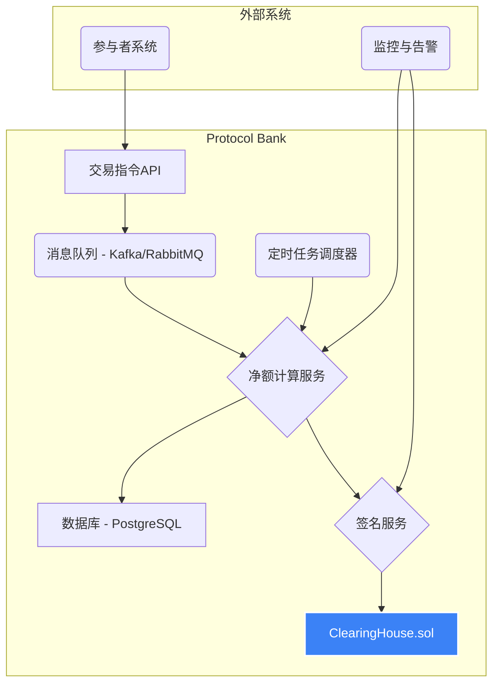

# 净额引擎 (Netting Engine) - 设计文档

**版本**: 1.0  
**日期**: 2025-11-08  
**作者**: Manus AI

---

## 1. 概述

净额引擎是Protocol Bank全球清算网络的核心链下组件。它负责在每个结算周期内,收集所有参与者的交易指令,计算每个参与者的净头寸(Net Position),并将这些头寸数据安全地提交给链上的`ClearingHouse.sol`智能合约进行最终结算。

这种**链下计算、链上结算**的混合模式,旨在大幅降低Gas成本,提高系统的可扩展性和效率,同时利用区块链保证最终结算的不可篡改性和安全性。

---

## 2. 系统架构

净额引擎采用模块化的微服务架构,确保系统的可维护性、可扩展性和弹性。

### 2.1. 架构图



### 2.2. 组件说明

| 组件 | 技术选型 | 核心职责 |
|---|---|---|
| **交易指令API** | Node.js + Express | 接收和验证来自参与者的交易指令,并将其推送到消息队列。 |
| **消息队列** | Kafka / RabbitMQ | 解耦API和计算服务,提供异步处理能力和数据持久性,确保交易指令不丢失。 |
| **净额计算服务** | Node.js / Go | 核心业务逻辑。消费消息队列中的交易,按结算周期进行分组,计算每个参与者的净头寸。 |
| **数据库** | PostgreSQL | 持久化存储交易数据、结算批次、净头寸和参与者信息。 |
| **签名服务** | Node.js + Ethers.js | 使用净额引擎的私钥对计算出的净头寸数据进行ECDSA签名,确保数据来源可信。 |
| **定时任务调度器** | Cron Job / BullMQ | 在每个结算周期结束时,触发净额计算和头寸提交流程。 |
| **监控与告警** | Prometheus + Grafana | 监控系统健康状况、交易量、结算成功率,并在出现异常时发送告警。 |

---

## 3. 数据模型

### 3.1. `trades` 表

用于记录每一笔原始交易指令。

```sql
CREATE TABLE trades (
    id SERIAL PRIMARY KEY,
    trade_id UUID UNIQUE NOT NULL,
    payer_address VARCHAR(42) NOT NULL,
    receiver_address VARCHAR(42) NOT NULL,
    amount NUMERIC(38, 18) NOT NULL,
    currency VARCHAR(10) NOT NULL DEFAULT 'USDC',
    settlement_batch_id INT,
    status VARCHAR(20) NOT NULL DEFAULT 'pending',
    created_at TIMESTAMP WITH TIME ZONE DEFAULT CURRENT_TIMESTAMP
);
```

### 3.2. `settlement_batches` 表

记录每个结算批次的信息。

```sql
CREATE TABLE settlement_batches (
    id SERIAL PRIMARY KEY,
    batch_id INT UNIQUE NOT NULL,
    window_end TIMESTAMP WITH TIME ZONE NOT NULL,
    positions JSONB NOT NULL,
    positions_hash VARCHAR(66) NOT NULL,
    signature VARCHAR(132) NOT NULL,
    status VARCHAR(20) NOT NULL DEFAULT 'submitted', -- submitted, settled, failed
    tx_hash VARCHAR(66),
    created_at TIMESTAMP WITH TIME ZONE DEFAULT CURRENT_TIMESTAMP
);
```

### 3.3. `participants` 表

缓存`ClearingHouse.sol`合约中的参与者信息。

```sql
CREATE TABLE participants (
    address VARCHAR(42) PRIMARY KEY,
    name VARCHAR(255) NOT NULL,
    registered_at TIMESTAMP WITH TIME ZONE NOT NULL
);
```

---

## 4. 核心工作流程

### 4.1. 交易指令接收

1.  **API接收**: 参与者通过HTTPS向`交易指令API`发送交易请求(如: A向B支付100 USDC)。
2.  **验证**: API验证请求的签名和参与者身份。
3.  **入队**: 验证通过后,将交易指令封装为消息,推送到Kafka的`trades`主题。

### 4.2. 净额计算与签名

1.  **调度触发**: `定时任务调度器`在结算周期结束时(如: 每小时整点)触发`净额计算服务`。
2.  **消费数据**: 服务从Kafka消费该结算周期的所有交易消息。
3.  **计算净额**: 服务遍历所有交易,使用一个Map来累加每个参与者的收支,最终得出净头寸。
    -   `netPositions[participant] += amount`
4.  **零和验证**: **关键步骤!** 验证所有净头寸的总和是否为零。如果不为零,则触发严重告警,流程中止。
5.  **数据签名**: 
    -   将净头寸数据打包并计算Keccak256哈希 (`positionsHash`)。
    -   将`batchId`, `windowEnd`, `positionsHash`拼接并再次哈希,生成最终的消息哈希 (`messageHash`)。
    -   `签名服务`使用净额引擎的私钥对`messageHash`进行签名,生成`signature`。

### 4.3. 链上提交与结算

1.  **提交头寸**: `净额计算服务`调用`ClearingHouse.sol`合约的`submitNetPositions`函数,传入`batchId`, `windowEnd`, `positions`, 和 `signature`。
2.  **链上验证**: 合约验证签名是否来自可信的净额引擎,并检查`batchId`是否重复。
3.  **执行结算**: 任何人(通常是自动化脚本)可以调用`settle`函数,合约会根据已提交的净头寸数据,在参与者的抵押品账户之间进行资金划转,完成最终结算。

---

## 5. API 规范

### `POST /v1/trades`

用于提交一笔新的交易指令。

**Request Body:**

```json
{
  "tradeId": "a1b2c3d4-e5f6-7890-1234-567890abcdef",
  "payerAddress": "0x...",
  "receiverAddress": "0x...",
  "amount": "1000.00",
  "currency": "USDC"
}
```

**Response (Success 202 Accepted):**

```json
{
  "status": "pending",
  "message": "Trade accepted for processing."
}
```

---

## 6. 安全与可靠性

| 风险点 | 缓解措施 |
|---|---|
| **单点故障** | 净额引擎的所有服务都将容器化(Docker)并部署在Kubernetes集群上,实现高可用和自动故障恢复。 |
| **数据丢失** | 使用Kafka作为持久化消息队列,确保即使计算服务宕机,交易指令也不会丢失。数据库进行定期备份。 |
| **恶意交易** | `交易指令API`对所有传入的请求进行严格的身份验证和签名校验。 |
| **计算错误** | 核心的净额计算逻辑必须经过严格的单元测试和集成测试,并包含**零和验证**作为最终防线。 |
| **私钥泄露** | 签名服务的私钥将存储在AWS KMS或HashiCorp Vault等硬件安全模块(HSM)中,服务只在需要时请求签名,私钥本身不暴露在应用内存中。 |
| **重放攻击** | `ClearingHouse.sol`合约会记录已处理的`batchId`,防止同一批次的结算被重复提交。`tradeId`在数据库中也设有唯一约束。 |

---

## 7. 部署与运维

- **部署**: 使用CI/CD流水线(GitHub Actions)自动化构建Docker镜像和部署到Kubernetes。
- **配置管理**: 使用环境变量和ConfigMap管理不同环境(开发、测试、生产)的配置。
- **日志**: 所有服务将日志输出到stdout,由Fluentd或类似工具统一收集到Elasticsearch或Loki中。
- **监控**: Prometheus负责收集指标,Grafana负责可视化,Alertmanager负责发送告警。

---

## 8. 未来优化方向

- **多币种支持**: 扩展数据模型和计算逻辑,以支持多种ERC20代币的同步结算。
- **性能优化**: 对于超大规模交易量,可以考虑使用更高性能的语言(如Rust)重写核心计算服务。
- **去中心化预言机**: 引入去中心化的预言机网络来替代中心化的定时任务调度器,进一步提升系统的去中心化程度。
