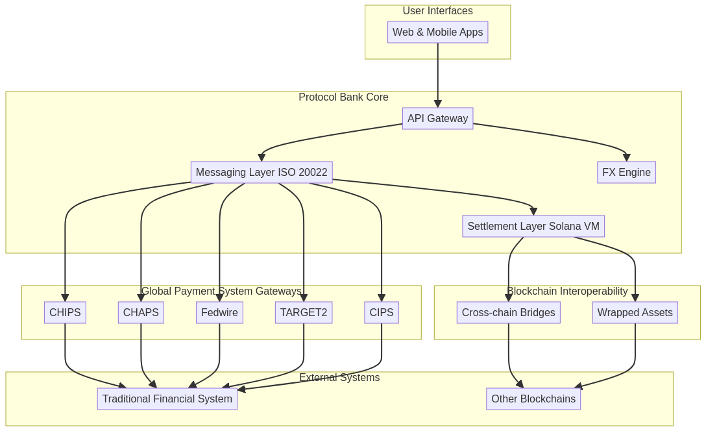
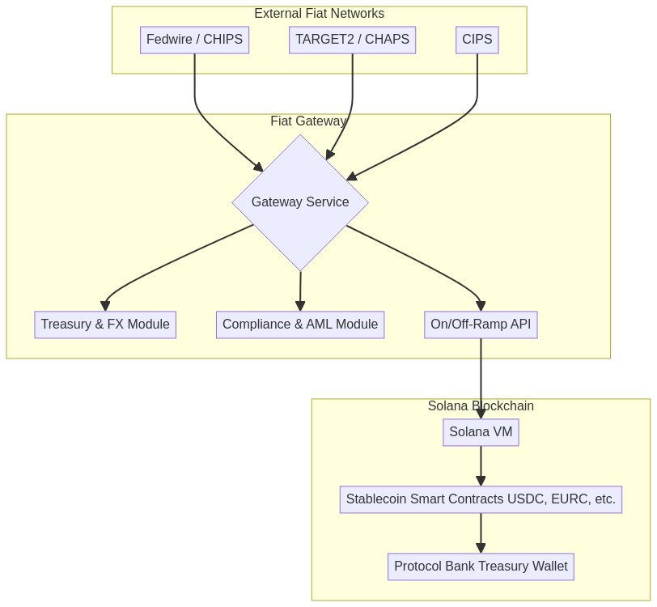
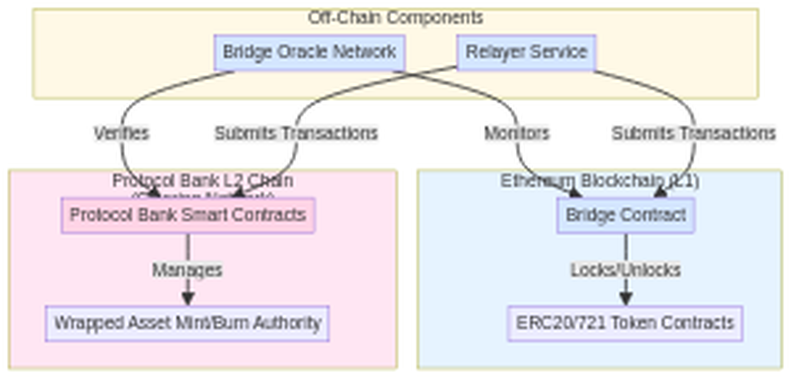
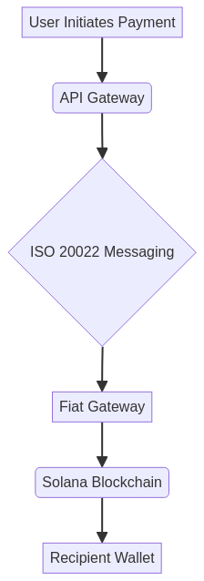
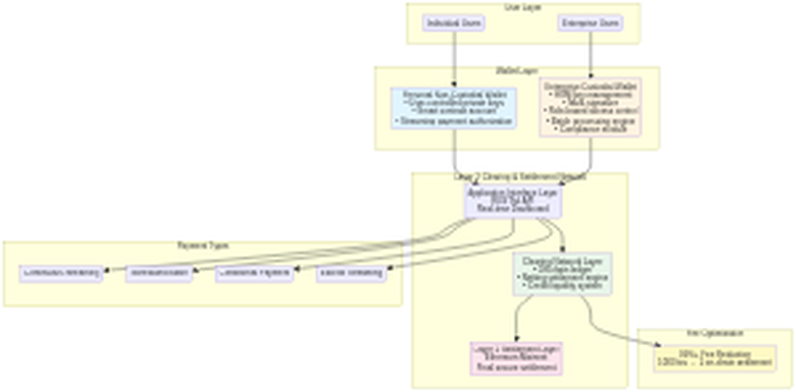
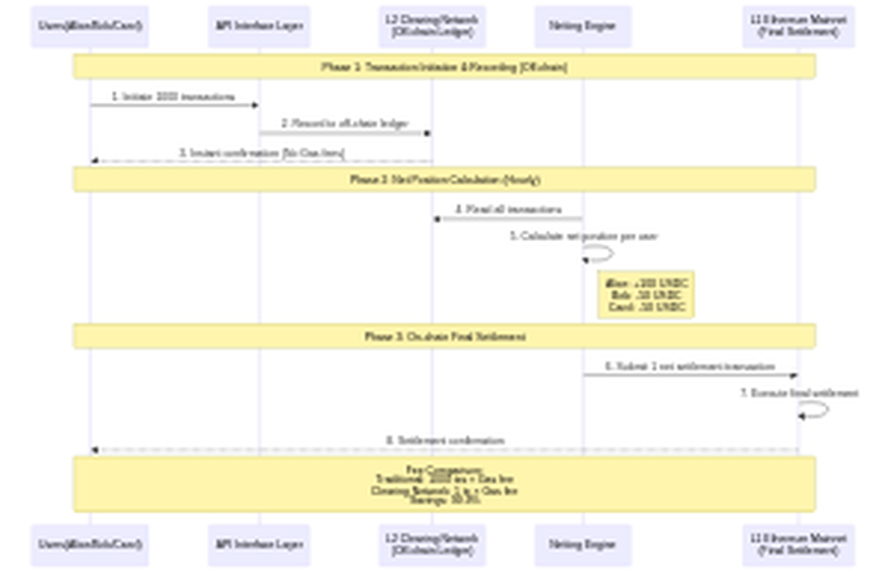

# Protocol Bank: A Comprehensive Whitepaper

---

'''
# Protocol Bank Whitepaper v2.0: The Future of Global Payments

## Abstract

Protocol Bank is a decentralized, blockchain-based platform designed to revolutionize the global payments landscape. By providing a secure, efficient, and low-cost alternative to traditional correspondent banking, Protocol Bank aims to become a leading competitor to SWIFT. The platform will integrate with major global payment systems, including CHIPS, CHAPS, Fedwire, TARGET2, and CIPS, to facilitate seamless cross-border transactions in major currencies. Leveraging the power of the Ethereum blockchain, Protocol Bank will offer real-time settlement, enhanced transparency, and significantly lower transaction costs.

## 1. The Challenge of Global Payments: A Fragmented and Inefficient System

The current infrastructure for global payments, built on a decades-old network of correspondent banks and messaging systems like SWIFT, is fundamentally broken. It is a fragmented patchwork of national systems, each with its own rules, operating hours, and technical standards. This fragmentation creates a system that is slow, expensive, and opaque, posing significant challenges for both individuals and businesses operating in the global economy.

This legacy system creates several critical pain points that Protocol Bank is designed to solve:

- **Exorbitant Fees:** A simple cross-border transaction can involve multiple intermediary (correspondent) banks, each levying a fee. These fees can accumulate to as much as 5-10% of the transaction value, a cost disproportionately borne by small businesses and individuals. This value leakage is a direct result of the system's inherent inefficiencies.

- **Glacial Settlement Times:** Payments can take anywhere from 2 to 5 business days to settle. This delay is a direct consequence of the system's reliance on batch processing and the need to coordinate across different time zones and national clearing cycles. For businesses, this ties up critical working capital and creates uncertainty.

- **Complete Lack of Transparency:** Once a payment is initiated, it enters a 'black box.' Senders and receivers have little to no visibility into the payment's status, its location in the correspondent chain, or the exact fees being deducted along the way. This opacity makes reconciliation difficult and erodes trust.

- **High Operational & Compliance Overhead:** Financial institutions must maintain complex relationships and pre-fund accounts (nostro/vostro accounts) with multiple correspondent banks across the globe. This ties up vast amounts of capital and creates significant operational and compliance overhead, further driving up costs.

- **High Costs:** Intermediary banks charge high fees for processing cross-border payments, which are ultimately passed on to the end-user.
- **Slow Settlement Times:** It can take several days for a cross-border payment to be settled, due to the number of intermediaries involved and the reliance on batch processing.
- **Lack of Transparency:** It is often difficult to track the status of a cross-border payment, and there is a lack of transparency regarding the fees charged by each intermediary.
- **Operational Risk:** The complexity of the correspondent banking system creates a number of operational risks, including the risk of errors, delays, and fraud.

## 2. The Protocol Bank Solution: A Unified Network for Global Value

Protocol Bank is engineered from the ground up to replace the outdated correspondent banking model with a modern, decentralized, and unified payment network. Our solution directly addresses the core inefficiencies of the legacy system by seamlessly bridging traditional finance and the digital asset economy.

### 2.1. Connecting the World's Clearing Networks

At the heart of Protocol Bank is a network of secure, bidirectional gateways that connect directly to the world's most critical real-time gross settlement (RTGS) and wholesale payment systems. By establishing direct or near-direct access to these financial highways, we bypass the convoluted correspondent banking chain entirely.

Our integration strategy targets the key arteries of global finance:

- **Fedwire & CHIPS (USA):** Providing direct access to the U.S. Dollar, the world's primary reserve currency.
- **TARGET2 (Europe):** Unlocking instant settlement for the Euro across the European Union.
- **CHAPS (UK):** Enabling real-time payments in Pound Sterling.
- **CIPS (China):** Creating a modern, efficient channel for the Chinese Yuan (RMB), a critical component of global trade.

This network of gateways allows Protocol Bank to act as a single, global clearing house for cross-border transactions, settling payments in minutes, not days.

### 2.2. Natively Supporting Fiat and Digital Currencies

Protocol Bank is designed for a world where both traditional fiat currencies and digital assets coexist. Our platform achieves this through a sophisticated hybrid architecture:

- **Fiat On/Off-Ramps:** Through our gateways, we can receive and send payments directly in native fiat currencies (USD, EUR, GBP, RMB, etc.).
- **Stablecoin Settlement Core:** On-chain, transactions are settled using fully-backed, 1:1 stablecoins (e.g., USDC, EURC) on the Ethereum blockchain. When a user initiates a USD payment, for example, the funds are received via the Fedwire gateway, instantly converted to USDC, and settled on-chain. The reverse process occurs for payouts.
- **Digital Asset Interoperability:** For users in the crypto economy, Protocol Bank provides seamless interoperability with major digital assets like Bitcoin (BTC) and Ethereum (ETH) through secure cross-chain bridges and wrapped assets. This allows for true global liquidity, connecting the fiat and crypto worlds in a single, fluid network.

Protocol Bank addresses these challenges by providing a decentralized, blockchain-based platform for cross-border payments. The platform is built on the following core principles:

- **Decentralization:** By leveraging the power of the Ethereum blockchain, Protocol Bank eliminates the need for intermediaries, resulting in faster, cheaper, and more secure transactions.
- **Interoperability:** Protocol Bank is designed to be interoperable with both traditional financial systems and other blockchain ecosystems. This is achieved through a multi-chain strategy that includes support for wrapped assets, cross-chain bridges, and Ethereum Improvement Proposals (EIPs).
- **Scalability:** The platform is built on the Ethereum blockchain and its Layer 2 scaling solutions, which are capable of processing thousands of transactions per second with low latency.* Protocol Bank implements robust security measures to protect against fraud and cyber-attacks. These include the use of multi-signature wallets, hardware security modules (HSMs), and regular security audits.
- **Compliance:** The platform is designed to be fully compliant with international standards and regulations, including Know Your Customer (KYC), Anti-Money Laundering (AML), and the ISO 20022 standard for financial messaging.

## 3. Technical Architecture

Protocol Bank's technical architecture is comprised of the following key components:

- **Multi-Chain Strategy:** While Ethereum serves as the primary settlement layer, Protocol Bank will support a variety of other blockchains, including Ethereum and BNB Chain. This will be achieved through the use of wrapped assets and secure cross-chain bridges.
- **Messaging Layer:** A secure and reliable messaging layer, based on the ISO 20022 standard, will be used to facilitate communication between financial institutions.
- **Settlement Layer:** The settlement layer, built on the Ethereum blockchain, will use smart contracts to automate the clearing and settlement process. Key features include atomic swaps, automated market makers (AMMs), and streaming payments.
- **Foreign Exchange (FX) Engine:** A real-time FX engine will provide competitive exchange rates for cross-currency transactions by aggregating liquidity from multiple providers.
- **API Gateway:** A comprehensive set of RESTful APIs will allow financial institutions to easily integrate with the Protocol Bank platform.

## 4. Integration with Global Payment Systems

Protocol Bank will integrate with the following major global payment systems:

- **CHIPS (Clearing House Interbank Payments System):** For large-value USD payments.
- **CHAPS (Clearing House Automated Payment System):** For large-value GBP payments.
- **Fedwire:** For real-time gross settlement of USD payments.
- **TARGET2:** For real-time gross settlement of EUR payments.
- **CIPS (Cross-Border Interbank Payment System):** For cross-border RMB payments.

This will enable Protocol Bank to offer a truly global payments solution, allowing users to send and receive payments in major currencies with ease.

## 5. Conclusion

Protocol Bank represents a significant step forward in the evolution of cross-border payments. By combining the best of traditional finance with the power of blockchain technology, Protocol Bank will provide a faster, cheaper, and more transparent alternative to the existing system. We believe that Protocol Bank has the potential to become a leading competitor to SWIFT and to revolutionize the way that money is moved around the world.
'''

## High-Level Architecture

## Fiat Gateway Architecture

## Cross-Chain Bridge Architecture

## Detailed Transaction Flow

## 5. Technical Specifications

This section provides a detailed technical specification of the Protocol Bank platform.

### 5.1. System Components

#### 5.1.1. Dual-Layer Blockchain Architecture

Protocol Bank employs an innovative dual-layer blockchain architecture that separates high-performance transaction processing from final secure settlement:

**Layer 1 (L1) - Ethereum Mainnet: Final Settlement Layer**

Ethereum Mainnet serves as Layer 1, providing ultimate security and immutability guarantees. Protocol Bank's core settlement smart contracts are deployed on Ethereum, written in Solidity:

- **Registry Contract:** Maintains a registry of all participating financial institutions, along with their associated public keys and other metadata.
- **Final Settlement Contract:** Processes net settlement transactions submitted from Layer 2, executing final on-chain fund transfers to ensure transaction finality and security.
- **Treasury Contract:** Manages the protocol's treasury, used to fund development, incentivize participation, and provide a backstop in case of shortfall events.
- **Bridge Contract:** Validates net settlement proofs submitted from Layer 2 and executes final settlement on Layer 1.

**Layer 2 (L2) - Proprietary Clearing Network: Off-Chain Netting Settlement Layer**

Protocol Bank's self-developed Layer 2 clearing network is the core enabler of low-cost, high-performance streaming payments. This layer is responsible for:

- **Off-Chain Ledger:** Records all high-frequency transactions, providing millisecond-level instant confirmation without Gas fees.
- **Netting Engine:** Calculates net positions for thousands of transactions within clearing cycles, simplifying complex transaction relationships into final net positions for each user.
- **Credit Liquidity System:** Provides instant credit authorization to users, allowing transactions before final settlement.
- **Distributed Clearing Nodes:** Ensures decentralization and high availability of the clearing network.

Through this dual-layer architecture, Protocol Bank achieves **99%+ fee reduction**: the vast majority of transactions are processed off-chain on Layer 2, with only final net results submitted to Layer 1 for secure settlement. For example, 1,000 transactions can be merged into 1 on-chain transaction, reducing Gas fees by 99.9%.

#### 5.1.2. Fiat Gateways

Fiat gateways are responsible for connecting the Protocol Bank platform to traditional financial systems. Each gateway is a standalone service that implements the following components:

- **Gateway Service:** This service listens for incoming payment messages from the respective fiat network (e.g., Fedwire, TARGET2) and initiates the corresponding on-chain transaction.
- **Treasury & FX Module:** This module manages the gateway's treasury and provides real-time foreign exchange (FX) rates.
- **Compliance & AML Module:** This module performs Know Your Customer (KYC) and Anti-Money Laundering (AML) checks on all incoming and outgoing transactions.
- **On/Off-Ramp API:** This API allows users to easily on-ramp and off-ramp fiat currencies to and from the Protocol Bank platform.

#### 5.1.3. Cross-chain Bridges

Cross-chain bridges are used to facilitate the transfer of assets between the Ethereum blockchain and other blockchain ecosystems, such as BNB Chain and Polygon. Protocol Bank will utilize a combination of existing bridge solutions and a custom-built bridge for specific use cases.

### 5.2. ISO 20022 Messaging

Protocol Bank uses the ISO 20022 standard for all financial messaging. This ensures interoperability with traditional financial systems and allows for the seamless exchange of rich payment data.

### 5.3. Security

Security is a top priority for Protocol Bank. The platform implements a variety of security measures to protect against fraud and cyber-attacks, including:

- **Multi-signature Wallets:** All critical functions, such as managing the protocol's treasury and upgrading smart contracts, are controlled by a multi-signature wallet.
- **Hardware Security Modules (HSMs):** Private keys are stored in hardware security modules (HSMs) to protect against theft and unauthorized access.
- **Regular Security Audits:** The platform undergoes regular security audits by independent third-party auditors to identify and address potential vulnerabilities.

## Core Principles of the Protocol

This section outlines the fundamental philosophical and operational principles that guide Protocol Bank's design and governance. These principles distinguish Protocol Bank from traditional financial institutions and conventional DeFi protocols.

### 1. Protocol as its Own Owner

This is the most fundamental principle. All revenue generated by the protocol—such as transaction fees, interest spreads, and liquidation penalties—is not distributed to any external token holders or corporate shareholders. Instead, all profits are returned 100% to the protocol's own treasury. Through this mechanism, the protocol "owns itself" and continuously accumulates capital, growing increasingly wealthy and powerful.

### 2. Value in Service, Not in Token

As there is no tradable governance token, there exists no market-speculated price. The system's "value" is not measured by token price. Its worth is directly reflected in the quality of service it provides to users:

*   **Stability:** The greater the protocol's treasury reserves, the more robust its issued stablecoin becomes, enhancing its resilience against risks.
*   **Efficiency:** The deeper the liquidity held by the protocol, the lower the slippage experienced by users during transactions, resulting in reduced costs.
*   **Reliability:** Protocol rules are permanently locked within code, assuring users it will perpetually operate according to established parameters, immune to alteration by group voting.

### 3. Achieving Governance through Inaction

The essence of this concept lies in its complete rejection of active, human-driven governance. It posits that the finest governance is "no governance". By embedding all core rules immutably within smart contracts at inception, it eliminates interference from human greed, short-sightedness, and political strife. The system operates autonomously like a machine governed by physical laws, responding to market shifts through pre-programmed algorithms (e.g., automatic interest rate adjustments) to achieve enduring stability and trustworthiness.

### 4. Lending as Capital Repatriation to the People

This principle redefines the purpose of lending, shifting it from a profit-generating mechanism for institutions to a service designed to return capital to the people. Unlike traditional banks that thrive on high interest-rate spreads to reward shareholders, the protocol operates as a non-profit conduit for capital, facilitated by hyper-efficient smart contracts.

#### 4.1. Cost-Neutral Lending: Eliminating Shareholder Profit

Protocol Bank introduces a **Cost-Neutral Lending** model, fundamentally shifting the purpose of lending from shareholder profit generation to a self-sustaining, non-profit service. Traditional banking profits from the spread between deposit and lending rates (e.g., 1-2% vs. 5-8%) to enrich shareholders. Protocol Bank eliminates this shareholder-driven profit motive.

**Dual-Layer Risk Coverage Mechanism**

By automating operations with smart contracts, costs are minimized. The minimal interest spread that remains is not for profit, but serves as the first layer of a dual-layer risk coverage mechanism:

1. **Minimal Interest Spread (First Line of Defense):**
   - Covers essential protocol maintenance and development costs.
   - Provides a buffer for minor, isolated default events.
   - Ensures day-to-day operational sustainability.

2. **PBX Safety Module (Backstop for Systemic Risk):**
   - Acts as the final line of defense against major, systemic default events.
   - In a crisis where the minimal spread is insufficient to cover losses, the protocol can **slash** a portion of the staked PBX in the Safety Module to recapitalize the system and ensure the stability of its stablecoins.
   - This mechanism provides robust, decentralized insurance, with PBX stakers acting as the ultimate guarantors of the protocol's solvency.

This represents a fundamental shift from **profit maximization** to **risk-managed sustainability**. Every basis point of the spread is justified by actual costs or risk, not by the desire to generate returns for external shareholders.

#### 4.2. Capital Returns to the People

The protocol's lending function is designed to serve, not to extract. This creates a virtuous cycle where capital flows efficiently to where it is most needed:

- **For Depositors:** Receive yields that closely track the true market rate of capital, rather than artificially suppressed rates designed to maximize institutional profit margins.
- **For Borrowers:** Access capital at costs that reflect only the actual risk premium and minimal operational overhead, not institutional markup.
- **For the Economy:** Capital circulates more efficiently, reducing friction and enabling productive economic activity that would otherwise be stifled by high borrowing costs.

The protocol acts as a transparent intermediary, not a profit-extracting middleman. Every basis point of interest spread is justified by actual costs or risk, not by the desire to generate returns for external shareholders.

#### 4.3. Automation Replaces Exploitation

Smart contracts execute lending operations with mathematical precision and complete transparency. This automation delivers several critical benefits:

- **Transparency:** All interest rates, collateral requirements, and liquidation parameters are visible on-chain and cannot be arbitrarily changed.
- **Efficiency:** Loans are issued and repaid automatically based on predefined conditions, eliminating delays and human error.
- **Fairness:** Access to capital is determined by cryptographic proof and collateral, not by subjective credit scores or discriminatory lending practices.
- **Accountability:** Every transaction is recorded immutably on the blockchain, creating a permanent audit trail.

By replacing costly human intermediaries with immutable, automated code, the protocol offers a transparent and equitable system where **capital is a public utility, not a tool for exploitation**. This aligns perfectly with the core idea of "Value in Service," where the protocol's success is defined by the direct economic benefits it delivers to its users, not by the profits it can extract from them.

## 6. Protocol Bank Tokenomics (PBX)

### 6.1. Introduction to the PBX Token

The Protocol Bank Token (PBX) is the native utility token of the Protocol Bank ecosystem. It is a critical component of the platform, designed to incentivize participation and secure the network. The PBX token is an ERC-20 token on the Ethereum blockchain, ensuring high-speed, low-cost transactions.

**Important Declaration: No-Governance Philosophy**

Unlike traditional DeFi projects, Protocol Bank adheres to the philosophy of **"Achieving Governance through Inaction."** The PBX token **does not have governance functions**, and holders cannot modify protocol parameters or rules through voting. All core economic parameters (such as fee structures, clearing cycles, and security thresholds) are **permanently locked in smart contract code** and cannot be changed.

This design ensures:
- **True Decentralization:** No individual or organization can control the protocol.
- **Long-term Predictability:** Users can trust that the protocol will always operate according to established rules.
- **Resistance to Politicization:** Eliminates risks of governance attacks, interest group influence, and short-sighted decision-making.

### 6.2. Core Token Functions

| PBX Core Role | Detailed Mechanism | Corresponding Whitepaper Function |
|---|---|---|
| **Network Security Staking** | Users stake PBX into the Safety Module to provide economic security for the L2 Clearing Network. Stakers, through the Slashing mechanism, bear the final line of defense against L2 misbehavior and systemic risks in the lending system. | Staking: Stake to earn security and rewards |
| **Liquidity Incentives** | Incentivizes users to provide liquidity to the **AMMs (Automated Market Makers)** of the FX Engine to reduce slippage for users when swapping stablecoins. | Liquidity Provision: Rewards in PBX tokens |
| **Value Capture/Deflation** | A portion of the platform's transaction fees is used to **buy back** PBX from the market and **burn** it. This reduces the total supply and increases the scarcity of the remaining tokens. | Transaction Fees / Fee Revenue |
| **Risk Compensation/Treasury Buyback** | PBX acts as the treasury's **"elastic asset"**. It is used to cover shortfalls in the event of losses in the L2 Clearing Network or systemic risks in the lending system. | Treasury Contract |

**Note**: The PBX token **does not have governance functions**. Holding PBX does not grant any power to modify protocol parameters, adjust fee structures, or add new features. All core rules are permanently locked in smart contracts.

### 6.3. Token Supply and Distribution

The total supply of PBX is capped at 1 billion tokens. The tokens will be distributed as follows:

| Category | Allocation | Vesting Schedule |
| :--- | :--- | :--- |
| **Community** | 50% (500,000,000 PBX) | 4-year linear vesting |
| **Team & Advisors** | 20% (200,000,000 PBX) | 1-year cliff, then 3-year linear vesting |
| **Ecosystem Fund** | 20% (200,000,000 PBX) | 4-year linear vesting |
| **Public Sale** | 10% (100,000,000 PBX) | No vesting |

### 6.4. Value Accrual

The PBX token accrues value through the following **automated, immutable** mechanisms:

- **Staking Yield:** PBX stakers receive a share of the protocol's transaction fees. The distribution ratio is preset and locked in smart contracts, and cannot be modified by anyone.
- **Automatic Buyback and Burn:** A portion of transaction fees is automatically used to buy back and burn PBX tokens, reducing total supply and increasing the value of remaining tokens. This is a deflationary mechanism executed entirely by smart contracts.
- **Security Incentive:** Stakers secure the network by bearing potential risks (possible slashing in extreme cases) and receive ongoing yields in return.

**Key Principle**: All parameters of these mechanisms (such as staking reward ratios, burn ratios, and slashing conditions) are permanently locked at deployment, and cannot be modified by anyone. This ensures system predictability and decentralization.

## 7. Streaming Payments: A Scalable Network for Real-Time Value Transfer

Protocol Bank introduces Streaming Payments, a revolutionary feature designed to facilitate the seamless, real-time flow of value across its network. This system evolves beyond simple transactions, establishing a sophisticated clearing and settlement network that dramatically reduces costs while enhancing efficiency and transparency. By supporting both personal non-custodial and enterprise custodial wallets, Protocol Bank provides a tailored solution for every type of user, from individuals to large corporations.

### 7.1. The Evolution from Escrow to a Global Clearing Network

Our initial foray into advanced payment flows, formerly known as "Flow Payment (Stake)," was designed to bring transparency to venture capital funding through a smart contract-based escrow system. While successful, we recognized a far greater opportunity: to build a universal network that could apply the principles of on-chain traceability and automated settlement to all forms of payment.

Streaming Payments represents the culmination of this vision. We have generalized the concept of controlled, auditable fund flows into a scalable clearing network that serves as the backbone for a new generation of payment applications, moving beyond the niche of VC funding to address the broader needs of the global economy.

### 7.2. The Dual Wallet Architecture: Empowering Every User

At the core of the Streaming Payments feature is a flexible dual wallet architecture that allows users to choose the model that best fits their needs for security, control, and convenience.

#### 7.2.1. Personal Non-Custodial Wallets

Designed for individuals who prioritize sovereignty over their assets, the personal non-custodial wallet ensures that only the user has access to their private keys. This model embodies the core principle of decentralization: "not your keys, not your coins."

- **Complete User Control**: Private keys are managed by the user via mnemonic phrases or integrated hardware wallets. All transactions must be signed and authorized directly by the user.
- **Smart Contract Accounts**: Leveraging Ethereum's smart contract accounts, each user gets a secure, on-chain account that can support advanced features like social recovery.
- **Stream Authorization**: Users can pre-authorize recurring payments (e.g., subscriptions, allowances) by setting specific parameters in a smart contract, which then executes the stream automatically without requiring manual intervention for each payment.

#### 7.2.2. Enterprise Custodial Wallets

Tailored for businesses and institutions, the enterprise custodial wallet provides a secure, managed environment that simplifies treasury operations and enhances security. Protocol Bank acts as a trusted custodian, handling the complexities of key management while providing powerful tools for financial administration.

- **Advanced Security**: Private keys are secured within Hardware Security Modules (HSMs) using multi-signature and cold/hot wallet segregation protocols, offering institutional-grade protection.
- **Multi-Level Role Management**: Enterprises can define a sophisticated hierarchy of user roles—such as admin, finance, approver, and operator—to enforce internal controls and approval workflows.
- **Batch Processing Engine**: A powerful engine allows for the creation and management of thousands of payment streams simultaneously, ideal for payroll, supplier payments, and platform payouts.
- **Automated Compliance**: The system integrates KYC/AML checks and automatically generates audit logs and compliance reports, simplifying regulatory adherence.

| Feature | Personal Non-Custodial Wallet | Enterprise Custodial Wallet |
| :--- | :--- | :--- |
| **Target User** | Individuals, Developers, Crypto Natives | Businesses, Institutions, Corporations |
| **Key Management** | User-controlled (self-custody) | Professionally managed by Protocol Bank |
| **Control** | Full and direct control over funds | Granular, role-based access and workflows |
| **Security** | User's responsibility | Institutional-grade (HSM, multi-sig) |
| **Use Cases** | P2P payments, subscriptions, payroll | Mass payouts, supply chain finance, treasury management |

### 7.3. The Clearing and Settlement Network

The engine powering Streaming Payments is a groundbreaking clearing and settlement network that combines the speed of off-chain bookkeeping with the finality of on-chain settlement. This hybrid approach allows Protocol Bank to reduce transaction fees by over 99% compared to traditional on-chain transactions.

**The Mechanism: Off-Chain Netting, On-Chain Settlement**

Instead of posting every single transaction to the blockchain, the clearing network records them in a high-throughput, off-chain ledger. At the end of a defined clearing cycle (e.g., every hour), the system calculates the net position of every participant. Only this final net settlement amount is committed to the Ethereum blockchain as a single transaction.

**Example of Fee Reduction:**
- **Traditional Method**: 1,000 individual payments would require 1,000 separate on-chain transactions.
- **Clearing Network Method**: The network processes all 1,000 payments off-chain and executes only **one** net settlement transaction on-chain.

This efficiency is achieved through a three-layer architecture:
1.  **Layer 1: Blockchain Settlement Layer (Ethereum)**: Provides ultimate security and finality for net settlements.
2.  **Layer 2: Clearing Network Layer**: A distributed network of nodes that records transactions, calculates net positions, and bundles them for settlement.
3.  **Layer 3: Application Interface Layer**: Provides APIs and real-time dashboards for users to initiate payments and monitor balances.

To ensure a real-time user experience, the network incorporates a credit and liquidity system. This allows recipients to access funds instantly based on their creditworthiness within the network, without having to wait for the on-chain settlement cycle to complete.

### 7.4. Supported Payment Types

The Streaming Payments architecture is highly flexible, supporting a variety of payment models to suit different use cases:

- **Continuous Streaming Payments**: Funds flow from sender to receiver at a constant rate, calculated per second. Perfect for salaries and subscriptions.
- **Scheduled Batch Payments**: Automate recurring bulk payments, such as monthly payroll or supplier invoices.
- **Conditional Payments**: Payments are held in escrow and automatically released when predefined conditions are met (e.g., project milestones confirmed by an oracle).
- **Escrow Streaming Payments**: The evolution of our original "Stake" feature, where an investor can deposit funds into a managed escrow and stream them to a project as it meets approved milestones, with full traceability.

### 7.5. Unlocking Unprecedented Benefits

The Streaming Payments and Dual Wallet architecture delivers a suite of powerful benefits:

- **Drastic Cost Reduction**: By netting transactions off-chain, gas fees are minimized, making micropayments and high-volume transactions economically viable.
- **Enhanced Efficiency**: Real-time visibility of funds, coupled with automation and batch processing, streamlines financial operations for both individuals and businesses.
- **Superior Security & Flexibility**: Users can choose between the absolute control of a non-custodial wallet or the managed security of a custodial wallet, all within an interoperable ecosystem.
- **Built-in Compliance**: The enterprise wallet provides a full suite of tools for audit, reporting, and regulatory adherence, simplifying financial management for organizations.

### 7.6. Architecture Diagrams

#### Wallet Architecture

The following diagram illustrates the dual wallet architecture and its integration with the clearing and settlement network:

#### Clearing Network Flow

The following sequence diagram demonstrates how the clearing network processes multiple transactions and settles them with a single on-chain transaction:

## 8. L2 Validator Network and Consensus Mechanism

To decentralize the L2 Clearing Network, the protocol employs a **Validator Network** run by PBX stakers.

### 8.1. Validator Network Architecture

| Component | Responsibilities & Mechanisms | Whitepaper Mapping |
|---|---|---|
| **Validators** | Run the L2 Clearing Network, responsible for recording, validating all off-chain transactions, and signing them for confirmation. Must stake a significant amount of PBX tokens. | Layer 2: Clearing Network Layer |
| **Consensus Algorithm** | Employs **Proof of Stake (PoS)** or its variants (e.g., BFT consensus) to ensure that only transactions confirmed by a majority of validators are written to the off-chain ledger. | Layer 2: Clearing Network Layer |
| **Netting Transaction** | After the validator network reaches consensus, a randomly selected or rotating validator is responsible for bundling and submitting the Net Settlement transaction to the **Layer 1 blockchain** (i.e., Ethereum L1). | Final On-Chain Settlement |

### 8.2. Validator Reward Mechanism

Validators are rewarded through:

- **Transaction Fee Sharing:** Validators receive a portion of the transaction fees from the L2 Clearing Network.
- **Staking Rewards:** Validators receive PBX staking rewards.

## 9. Slashing Mechanism and Dispute Resolution

Disputes typically arise when: a validator misbehaves (e.g., signs an incorrect transaction) or a clearing transaction is not submitted to L1.

| Risk Scenario | Dispute Resolution Mechanism (Slashing) | Associated Token Role |
|---|---|---|
| **Misbehavior/Data Tampering** | Anyone (a user or monitoring node) who discovers that a validator has signed an invalid or incorrect off-chain transaction can submit a Fraud Proof to the L1 smart contract. | Once the fraud is proven, the misbehaving validator's staked PBX tokens will be **slashed**, with a portion used to reward the whistleblower and another portion to compensate affected users. |
| **Clearing Failure/Delay** | If a validator fails to timely submit the L2 net transaction to L1, and users suffer losses as a result. | The protocol can automatically trigger the slashing of the validator and use the slashed PBX to pay a Relayer service to submit the transaction, or to compensate users for losses incurred due to the delay. |

This mechanism ensures the economic security of the L2 Clearing Network: **the cost of misbehavior far outweighs the potential benefits**.

## 10. System Profitability and Sustainability

Protocol Bank's design core is **"the protocol owns itself,"** shifting from profit maximization to cost minimization.

### 10.1. Profitability Mechanism (Flowing into the Protocol Treasury)

| Profit Source | Mechanism Description | Purpose |
|---|---|---|
| **Transaction Clearing Fees** | A very low percentage fee is charged on cross-border transactions settled through the L2 Clearing Network and L1. | To cover L1 Gas fees, L2 validator rewards, and operational and development costs. |
| **FX Engine Transaction Fees** | A very low exchange fee is charged through AMMs when users conduct cross-currency transactions (e.g., USDC to EURC). | To increase treasury funds, used to provide deeper liquidity and thus reduce user slippage. |
| **Minimal Spread** | The **cost-neutral spread** charged by the lending function. | To cover the operating costs of the lending system and buffer against potential default risks. |
| **Slashing Revenue** | Premiums generated from slashing the PBX tokens of misbehaving validators or liquidating loan collateral. | To maintain network security, stability, and compensate for systemic losses. |

### 10.2. Value Accumulation (Enhancing Service Quality)

The protocol returns **100%** of all revenue to the Protocol Treasury. Treasury funds are used to:

- **Enhance Stability:** Increase the reserve support for stablecoins.
- **Improve Efficiency:** Enhance the liquidity of AMMs to reduce user slippage.
- **Incentivize the Ecosystem:** Reward PBX stakers, liquidity providers, and developers.

With the above solutions, your whitepaper will have a logically closed and economically sustainable model:

1. **High Efficiency (Streaming Payments):** Achieves low-cost transactions through L2 netting.
2. **Economic Security (PBX):** PBX staking provides security for the L2 Clearing Network and the lending system.
3. **Sustainability (Profitability):** All revenue is returned to the treasury, achieving the long-term goal of "Value in Service."
