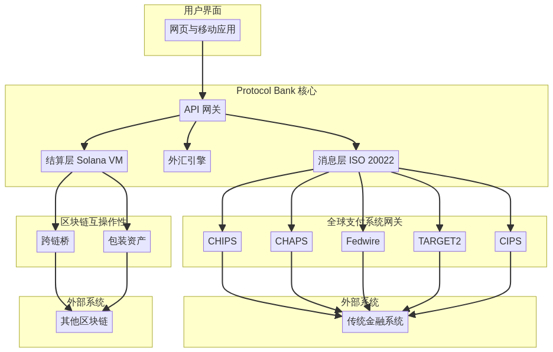
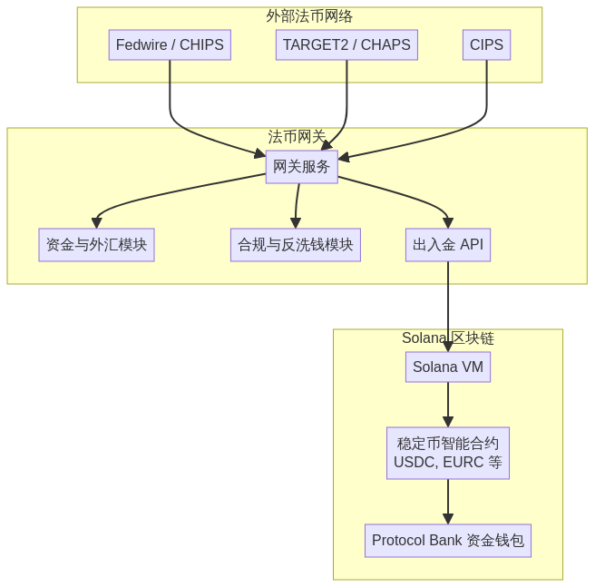
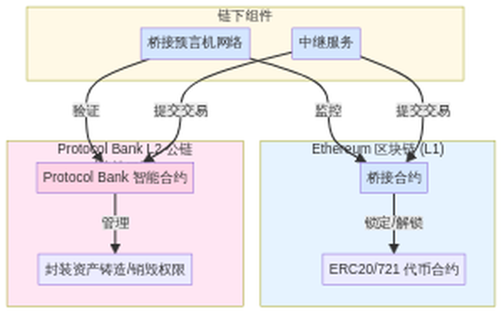
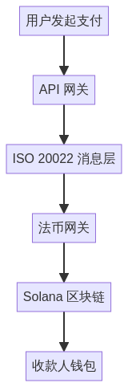
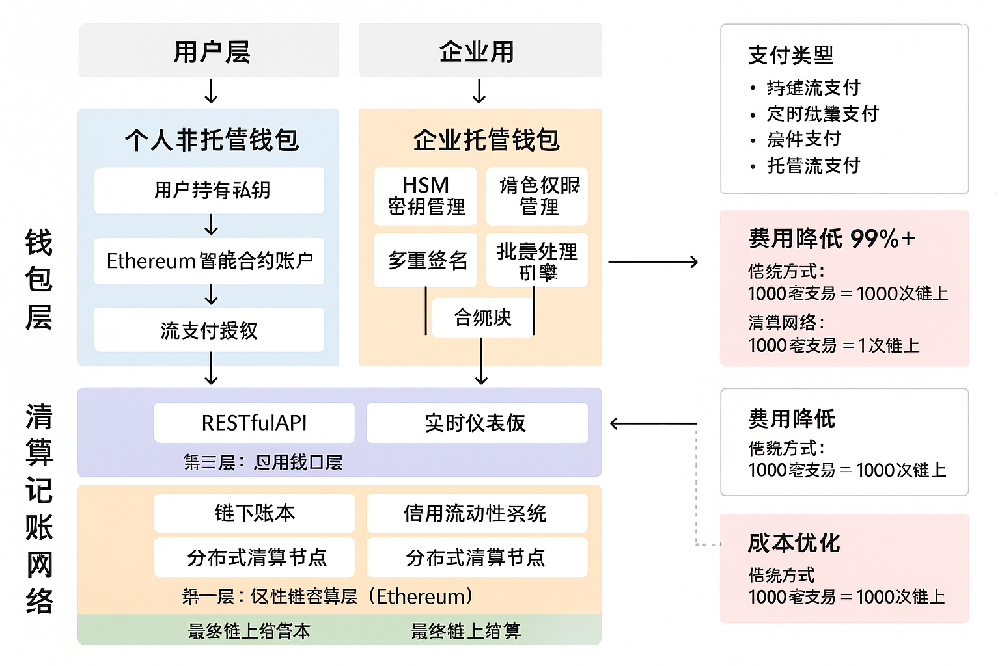
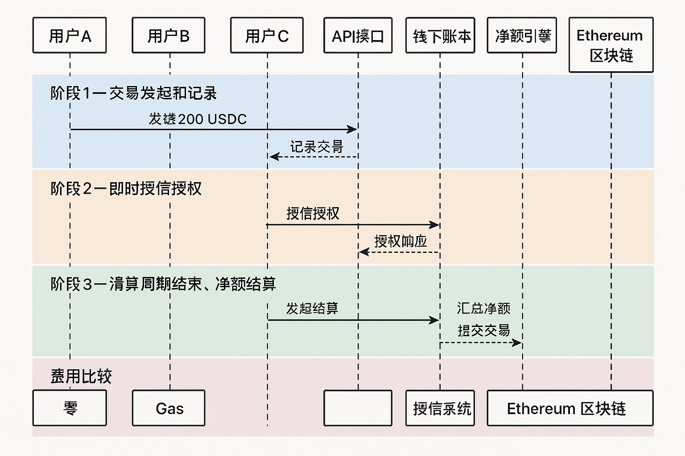

'''
# 协议银行白皮书 v2.0：全球支付的未来

## 摘要

协议银行（Protocol Bank）是一个去中心化的区块链（blockchain）平台，旨在彻底革新全球支付格局。通过提供一种安全、高效且低成本的传统代理银行（correspondent banking）替代方案，协议银行目标成为SWIFT的主要竞争者。该平台将整合包括CHIPS、CHAPS、Fedwire、TARGET2和CIPS在内的主要全球支付系统，实现主要货币的无缝跨境交易。借助Ethereum区块链的强大能力，协议银行将提供实时结算、增强透明度以及显著降低的交易成本。

## 1. 全球支付的挑战：一个支离破碎且低效的系统

当前全球支付基础设施建立在数十年前的代理银行网络和如SWIFT这类消息系统之上，结构上存在根本性缺陷。它是一个由各国系统组成的碎片化拼凑体，每个系统拥有自己的规则、运营时间和技术标准。这种碎片化导致系统运行缓慢、成本高昂且缺乏透明度，给全球经济中的个人和企业带来了重大挑战。

这一传统系统带来了协议银行旨在解决的几个关键痛点：

- **高额费用：** 一笔简单的跨境交易可能涉及多个中间代理银行，每家都会收取费用。这些费用累计可能高达交易金额的5-10%，这笔成本主要由小企业和个人承担。这种价值流失直接源于系统固有的低效率。

- **缓慢的结算时间：** 付款结算可能需要2至5个工作日。这种延迟直接源于系统依赖批量处理以及跨时区和国家清算周期的协调需求。对企业而言，这占用了关键的营运资金并带来不确定性。

- **完全缺乏透明度：** 一旦付款发起，就进入了“黑箱”状态。付款发起方和接收方几乎无法了解付款状态、其在代理链中的位置或沿途被扣除的具体费用。这种不透明性使对账变得困难并削弱信任。

- **高昂的运营与合规成本：** 金融机构必须与全球多个代理银行维持复杂关系并预先资金账户（nostro/vostro账户）。这占用了大量资本并带来了显著的运营与合规负担，进一步推高成本。

'''

- **高成本：** 中介银行对跨境支付收取高额费用，最终由终端用户承担。
- **结算时间缓慢：** 由于涉及多个中介机构且依赖批量处理，跨境支付的结算可能需要数天时间。
- **缺乏透明度：** 跨境支付的状态通常难以追踪，各中介机构收取的费用缺乏透明度。
- **操作风险：** 代理银行系统的复杂性带来了多种操作风险，包括错误、延误和欺诈的风险。

## 2. 协议银行解决方案：全球价值统一网络

协议银行（Protocol Bank）从零开始设计，旨在用现代化、去中心化且统一的支付网络取代过时的代理银行（Correspondent Banking）模式。我们的解决方案直接针对传统系统的核心低效问题，通过无缝连接传统金融与数字资产经济，实现创新突破。

### 2.1. 连接全球清算网络

协议银行的核心是一张安全的双向网关网络，直接连接全球最关键的实时全额结算系统（RTGS，Real-Time Gross Settlement）和批发支付系统。通过建立对这些金融高速公路的直接或近乎直接访问，我们完全绕过了复杂的代理银行链条。

我们的集成策略瞄准全球金融的关键动脉：

- **Fedwire & CHIPS（美国）：** 提供对全球主要储备货币——美元的直接访问。
- **TARGET2（欧洲）：** 实现欧元在欧盟范围内的即时结算。
- **CHAPS（英国）：** 支持英镑的实时支付。
- **CIPS（中国）：** 构建现代高效的人民币（RMB）通道，作为全球贸易的重要组成部分。

这张网关网络使协议银行能够作为单一的全球清算所，跨境交易结算时间缩短至分钟级，而非数天。

### 2.2. 原生支持法币与数字货币

协议银行设计之初即考虑到传统法定货币（Fiat Currency）与数字资产（Digital Assets）共存的未来。我们的平台通过复杂的混合架构实现这一目标：

- **法币进出通道（Fiat On/Off-Ramps）：** 通过我们的网关，能够直接接收和发送本地法币支付（美元USD、欧元EUR、英镑GBP、人民币RMB等）。
- **稳定币结算核心（Stablecoin Settlement Core）：** 在链上，交易通过完全支持的1:1稳定币（例如USDC、EURC）在高性能的Ethereum区块链上结算。例如，当用户发起美元支付时，资金通过Fedwire网关接收，立即转换为USDC，并在链上完成结算。支付时则执行相反流程。
- **数字资产互操作性（Digital Asset Interoperability）：** 对于加密经济中的用户，Protocol Bank通过安全的跨链桥和包装资产（wrapped assets），实现与比特币（Bitcoin, BTC）、以太坊（Ethereum, ETH）等主流数字资产的无缝互操作。这使得真正的全球流动性成为可能，将法币与加密世界连接在一个流畅的网络中。

Protocol Bank通过提供一个去中心化的、基于区块链的跨境支付平台来解决这些挑战。该平台基于以下核心原则构建：

- **去中心化（Decentralization）：** 利用Ethereum区块链的强大能力，Protocol Bank消除了中介的需求，实现更快、更低成本且更安全的交易。
- **互操作性（Interoperability）：** Protocol Bank设计为可与传统金融系统及其他区块链生态系统互操作。通过多链策略支持包装资产、跨链桥以及以太坊改进提案（Ethereum Improvement Proposals, EIPs）实现。
- **可扩展性（Scalability）：** 平台基于Ethereum区块链及其Layer 2扩展解决方案，能够以低延迟处理每秒数千笔交易。
- **安全性（Security）：** Protocol Bank实施强有力的安全措施以防范欺诈和网络攻击，包括多重签名钱包、多硬件安全模块（Hardware Security Modules, HSMs）及定期安全审计。
- **合规性（Compliance）：** 平台设计完全符合国际标准和法规，包括了解你的客户（Know Your Customer, KYC）、反洗钱（Anti-Money Laundering, AML）以及金融消息标准ISO 20022。

## 3. 技术架构

Protocol Bank的技术架构由以下关键组件组成：

- **多链策略 (Multi-Chain Strategy)：** 虽然 Ethereum 作为主要的结算层，Protocol Bank 还将支持包括以太坊 (Ethereum) 和币安智能链 (BNB Chain) 在内的多种其他区块链。这将通过使用封装资产 (wrapped assets) 和安全的跨链桥 (cross-chain bridges) 实现。
- **消息层 (Messaging Layer)：** 基于 ISO 20022 标准的安全可靠消息层将用于促进金融机构之间的通信。
- **结算层 (Settlement Layer)：** 构建于 Ethereum 区块链上的结算层将使用智能合约 (smart contracts) 自动化清算和结算流程。主要功能包括原子交换 (atomic swaps)、自动做市商 (AMMs, Automated Market Makers) 和流式支付 (streaming payments)。
- **外汇引擎 (Foreign Exchange, FX Engine)：** 实时外汇引擎将通过聚合多个流动性提供者的资金，为跨币种交易提供具有竞争力的汇率。
- **API 网关 (API Gateway)：** 一套全面的 RESTful API 将允许金融机构轻松集成 Protocol Bank 平台。

## 4. 与全球支付系统的集成

Protocol Bank 将集成以下主要全球支付系统：

- **CHIPS（清算所银行间支付系统，Clearing House Interbank Payments System）：** 用于大额美元支付。
- **CHAPS（清算所自动支付系统，Clearing House Automated Payment System）：** 用于大额英镑支付。
- **Fedwire：** 用于美元支付的实时全额结算。
- **TARGET2：** 用于欧元支付的实时全额结算。
- **CIPS（跨境银行间支付系统，Cross-Border Interbank Payment System）：** 用于跨境人民币支付。

这将使 Protocol Bank 能够提供真正的全球支付解决方案，方便用户轻松发送和接收主要货币的支付。

## 5. 结论

Protocol Bank 代表了跨境支付演进的重要一步。通过结合传统金融的优势与区块链技术的力量，Protocol Bank 将提供比现有系统更快、更便宜且更透明的替代方案。我们相信，Protocol Bank 有潜力成为 SWIFT 的主要竞争者，彻底改变全球资金流动的方式。
'''

## 高级架构

## 法币网关架构

## 跨链桥架构

## 详细交易流程

## 5. 技术规格

本节提供 Protocol Bank 平台的详细技术规格。

### 5.1. 系统组件

#### 5.1.1. 双层区块链架构

Protocol Bank 采用创新的双层区块链架构，将高性能交易处理与最终安全结算相分离：

**Layer 1 (L1) - Ethereum 主网：最终结算层**

Ethereum 主网作为 Layer 1，提供最终的安全性和不可篡改性保证。Protocol Bank 的核心结算智能合约部署在 Ethereum 上，采用 Solidity 语言编写：

- **注册合约（Registry Contract）：** 维护所有参与金融机构的注册信息，以及它们关联的公钥和其他元数据。
- **最终结算合约（Final Settlement Contract）：** 负责处理从 Layer 2 提交的净额结算交易，执行最终的链上资金转移，确保交易的最终性和安全性。
- **国库合约（Treasury Contract）：** 管理协议的国库，用于资助开发、激励参与以及在短缺事件发生时提供后备支持。
- **桥接合约（Bridge Contract）：** 负责验证 Layer 2 提交的净额结算证明，并在 Layer 1 上执行最终结算。

**Layer 2 (L2) - 自研清算网络：离线净额结算层**

Protocol Bank 自主研发的 Layer 2 清算网络是实现低成本、高性能流支付的核心。该层负责：

- **链下账本（Off-Chain Ledger）：** 记录所有高频交易，提供毫秒级的即时确认，无需支付 Gas 费用。
- **净额结算引擎（Netting Engine）：** 在清算周期内对数千笔交易进行净额计算，将复杂的交易关系简化为每个用户的最终净头寸。
- **信用流动性系统（Credit Liquidity System）：** 为用户提供即时的信用授权，允许在最终结算前进行交易。
- **分布式清算节点（Distributed Clearing Nodes）：** 确保清算网络的去中心化和高可用性。

通过这种双层架构，Protocol Bank 实现了 **99%+ 的费用降低**：绝大多数交易在 Layer 2 链下处理，只有最终的净额结果才提交到 Layer 1 进行安全结算。例如，1000 笔交易可以合并为 1 笔链上交易，从而将 Gas 费用降低 99.9%。

#### 5.1.2. 法币网关（Fiat Gateways）

法币网关负责将协议银行平台（Protocol Bank）连接到传统金融系统。每个网关都是一个独立服务，包含以下组件：

- **网关服务（Gateway Service）：** 该服务监听来自相应法币网络（如Fedwire、TARGET2）的入账支付消息，并发起相应的链上交易。
- **国库与外汇模块（Treasury & FX Module）：** 该模块管理网关的国库，并提供实时外汇（FX）汇率。
- **合规与反洗钱模块（Compliance & AML Module）：** 该模块对所有进出交易执行客户身份识别（KYC，Know Your Customer）和反洗钱（AML，Anti-Money Laundering）检查。
- **入金/出金API（On/Off-Ramp API）：** 该API允许用户轻松地将法币入金和出金至协议银行平台。

#### 5.1.3. 跨链桥（Cross-chain Bridges）

跨链桥用于促进Ethereum区块链与其他区块链生态系统（如以太坊和BNB链）之间的资产转移。协议银行将结合现有桥接解决方案和定制桥接以满足特定用例需求。

### 5.2. ISO 20022 消息标准

协议银行采用ISO 20022标准进行所有金融消息传递。这确保了与传统金融系统的互操作性，并允许丰富支付数据的无缝交换。

### 5.3. 安全性

安全是协议银行的首要任务。平台实施多种安全措施以防范欺诈和网络攻击，包括：

- **多签钱包（Multi-signature Wallets）：** 所有关键功能，如管理协议国库和升级智能合约，均由多签钱包控制。
- **硬件安全模块（HSMs，Hardware Security Modules）：** 私钥存储于硬件安全模块中，以防止被盗和未经授权访问。
- **定期安全审计（Regular Security Audits）：** 平台定期由独立第三方审计机构进行安全审计，以识别和修复潜在漏洞。

## 协议的核心原则

本节概述了指导协议银行设计和治理的基本哲学和运营原则。这些原则使协议银行区别于传统金融机构和常规DeFi协议。

### 1. 协议作为其自身的所有者

这是最根本的原则。协议产生的所有收入——例如交易费、利息差和清算罚金——不分配给任何外部代币持有者或公司股东。相反,所有利润100%返还给协议自身的金库。通过这种机制,协议"拥有自己",并不断积累资本,变得越来越富有和强大。

### 2. 价值在于服务,而非代币

由于没有可交易的治理代币,因此不存在市场炒作的价格。系统的"价值"不由代币价格衡量。其价值直接反映在它为用户提供的服务质量上:

*   **稳定性:** 协议金库储备越多,其发行的稳定币就越稳健,抗风险能力也越强。
*   **效率:** 协议持有的流动性越深,用户在交易中遇到的滑点就越低,从而降低成本。
*   **可靠性:** 协议规则被永久锁定在代码中,向用户保证它将永远按照既定参数运行,不受团体投票的改变。

### 3. 通过无为实现治理

这一概念的精髓在于完全拒绝主动的、人为驱动的治理。它假设最好的治理是"无治理"。通过在创建之初就将所有核心规则不可变地嵌入智能合约中,它消除了人类贪婪、短视和政治斗争的干扰。该系统像一台由物理定律支配的机器一样自主运行,通过预设的算法(例如,自动利率调整)来应对市场变化,以实现持久的稳定性和可信赖性。

### 4. 借贷作为资本向人民的回流

该原则重新定义了借贷的目的,将其从一个为机构创造利润的机制,转变为一项旨在将资本返还给人民的服务。与传统银行依靠高利率差来回报股东不同,该协议作为一个非营利的资本通道运作,由超高效的智能合约推动。

#### 4.1. 成本中性借贷：消除股东利润

协议银行引入了**成本中性借贷 (Cost-Neutral Lending)** 模型，从根本上将借贷的目的从为股东创造利润转变为一种自我维持的非营利性服务。传统银行通过存贷利率差（例如1-2% vs 5-8%）为股东牟利，协议银行则消除了这种以股东为导向的利润动机。

**双层风险覆盖机制**

通过智能合约自动化运营，成本被降至最低。剩余的极小利息差额不用于盈利，而是作为双层风险覆盖机制的第一层：

1. **最小利差（第一道防线）：**
   - 覆盖必要的协议维护和开发成本。
   - 为轻微、孤立的违约事件提供缓冲。
   - 确保日常运营的可持续性。

2. **PBX安全模块（系统性风险的最后防线）：**
   - 作为抵御重大、系统性违约事件的最后一道防线。
   - 在危机中，当最小利差不足以弥补损失时，协议可以**清算（Slashing）**安全模块中质押的部分PBX，以重新资本化系统并确保其稳定币的稳定性。
   - 这一机制提供了强大的、去中心化的保险，PBX质押者是协议偿付能力的最终担保人。

这代表了从**利润最大化**到**风险管理下的可持续性**的根本转变。息差的每一个基点都由实际成本或风险证明其合理性，而不是为外部股东创造回报的欲望。

#### 4.2. 资本回归人民

协议的借贷功能旨在服务,而非榨取。这创造了一个良性循环,让资本高效地流向最需要它的地方:

- **对于储户:** 获得紧密跟踪资本真实市场利率的收益,而不是为了最大化机构利润而人为压低的利率。
- **对于借款人:** 以仅反映实际风险溢价和最小运营开销的成本获得资本,而不是机构加价。
- **对于经济:** 资本循环更加高效,减少摩擦,促进原本会因高借贷成本而受阻的生产性经济活动。

协议充当透明的中介,而不是提取利润的中间商。利息差的每一个基点都由实际成本或风险证明其合理性,而不是为外部股东创造回报的欲望。

#### 4.3. 自动化取代剥削

智能合约以数学精度和完全透明的方式执行借贷操作。这种自动化带来了几个关键优势:

- **透明性:** 所有利率、抵押要求和清算参数都在链上可见,不能被任意更改。
- **效率:** 贷款根据预定义条件自动发放和偿还,消除延迟和人为错误。
- **公平性:** 获得资本的途径由加密证明和抵押品决定,而不是主观的信用评分或歧视性贷款做法。
- **问责制:** 每笔交易都不可变地记录在区块链上,创建永久审计跟踪。

通过用不可变的自动化代码取代昂贵的人力中介,该协议提供了一个透明、公平的系统,其中**资本是一种公共事业,而不是剥削的工具**。这与"价值在于服务"的核心理念完美契合,即协议的成功是由它为其用户带来的直接经济利益所定义的,而不是它能从他们那里提取的利润。

## 6. 协议银行代币经济学（Protocol Bank Tokenomics，PBX）

### 6.1. PBX 代币简介

Protocol Bank 代币（PBX）是 Protocol Bank 生态系统的原生效用代币（Utility Token）。它是平台的关键组成部分，旨在激励参与、保障网络安全。PBX 代币是基于 Ethereum 区块链的 ERC-20 代币，确保交易高速且成本低廉。

**重要声明：无治理哲学**

与传统 DeFi 项目不同，Protocol Bank 坚持 **"通过无为实现治理"** 的哲学。PBX 代币**不具有治理功能**，持有者无法通过投票修改协议参数或规则。所有核心经济参数（如费用结构、清算周期、安全阈值）均被**永久锁定在智能合约代码中**，不可更改。

这种设计确保了：
- **去中心化的真实性**：没有任何个人或组织能够控制协议。
- **长期可预测性**：用户可以确信协议将永远按照既定规则运行。
- **抗政治化**：消除了治理攻击、利益集团影响和短视决策的风险。

### 6.2. 代币核心功能

| PBX核心作用 | 详细机制 | 白皮书中对应功能 |
|---|---|---|
| **网络安全质押** | 用户将 PBX 质押到 Safety Module，为 L2 清算网络提供经济安全抵押。质押者通过削减 (Slashing) 机制，承担 L2 作恶和借贷系统性风险的最后防线。 | Staking: 质押以获得安全和奖励 |
| **流动性激励** | 激励用户为 FX Engine 的 **AMMs (自动做市商)** 提供流动性，以降低用户在兑换稳定币时的滑点。 | Liquidity Provision: 奖励 PBX 代币 |
| **价值捕获/通缩** | 平台收取的部分交易费用用于在市场上**回购 (Buyback)** PBX，并将其**销毁 (Burn)**。这减少了总供应量，增加了剩余代币的稀缺性。 | Transaction Fees / Fee Revenue |
| **风险弥补/国库回购** | PBX 作为国库的**"弹性资产"**。在 L2 清算网络出现损失或借贷系统性风险时，用于弥补资金短缺。 | Treasury Contract |

**注意**：PBX 代币**不具有治理功能**。持有 PBX 不会赋予任何修改协议参数、调整费用结构或添加新功能的权力。所有核心规则已永久锁定在智能合约中。

### 6.3. 代币总量及分配

PBX 代币总供应量上限为 10 亿枚，分配如下：

| 类别 | 分配比例 | 解锁计划 |
| :--- | :--- | :--- |
| **社区 (Community)** | 50%（5亿 PBX） | 4 年线性解锁 |
| **团队及顾问 (Team & Advisors)** | 20%（2亿 PBX） | 1 年悬崖期，随后 3 年线性解锁 |
| **生态基金 (Ecosystem Fund)** | 20%（2亿 PBX） | 4 年线性解锁 |
| **公开销售 (Public Sale)** | 10%（1亿 PBX） | 无解锁期 |

### 6.4. 价值积累

PBX 代币通过以下**自动化、不可更改**的机制实现价值积累：

- **质押收益 (Staking Yield)：** PBX 质押者将获得协议交易费用的分成。分配比例已预先设定并锁定在智能合约中，不可人为修改。
- **自动回购与销毁 (Automatic Buyback and Burn)：** 部分交易费用将自动用于回购并销毁 PBX 代币，减少总供应量，提升剩余代币价值。这是一个完全由智能合约执行的通缩机制。
- **安全保障激励 (Security Incentive)：** 质押者通过承担潜在风险（在极端情况下可能被减记）来保障网络安全，作为回报获得持续的收益。

**关键原则**：所有这些机制的参数（如质押奖励比例、燀烧比例、减记条件）均已在部署时永久锁定，任何人无法修改。这确保了系统的可预测性和去中心化。

## 7. 流支付：一个用于实时价值转移的可扩展网络

协议银行（Protocol Bank）引入了流支付（Streaming Payments）功能，这是一项革命性的创新，旨在促进价值在其网络中的无缝、实时流动。该系统超越了简单的交易，建立了一个先进的清算记账网络，在显著降低成本的同时，提升了效率和透明度。通过同时支持个人非托管钱包和企业托管钱包，协议银行（Protocol Bank）为从个人到大型企业的各类用户提供了量身定制的解决方案。

### 7.1. 从托管系统到全球清算网络的演进

我们最初在高级支付流程领域的探索，即此前的“流支付（质押）”功能，旨在通过基于智能合约的托管系统为风险投资带来透明度。虽然该功能取得了成功，但我们认识到了一个远大的机遇：构建一个通用网络，将链上可追溯性和自动结算的原则应用于所有形式的支付。

流支付（Streaming Payments）正是这一愿景的结晶。我们将受控、可审计的资金流概念推广为一个可扩展的清算网络，为新一代支付应用提供了支柱，超越了风险投资的特定领域，以满足全球经济更广泛的需求。

### 7.2. 双钱包架构：赋能每一位用户

流支付（Streaming Payments）功能的核心是一种灵活的双钱包架构，允许用户根据其对安全性、控制权和便利性的需求选择最适合自己的模式。

#### 7.2.1. 个人非托管钱包

个人非托管钱包专为优先考虑资产主权的个人用户设计，确保只有用户本人能够访问其私钥。该模式体现了去中心化的核心原则：“不是你的私钥，就不是你的资产。”

- **完全用户控制**：私钥通过助记词或集成硬件钱包由用户管理。所有交易必须由用户直接签名授权。
- **智能合约账户**：利用 Ethereum 的智能合约账户，每位用户都拥有一个安全的链上账户，可支持社交恢复等高级功能。
- **流支付授权**：用户可通过在智能合约中设置特定参数，预授权经常性支付（如订阅、津贴），从而实现流支付的自动执行，无需为每笔支付手动操作。

#### 7.2.2. 企业托管钱包

企业托管钱包专为企业和机构量身定制，提供了一个安全、受管理的环境，简化了资金运营并增强了安全性。协议银行（Protocol Bank）作为可信赖的托管方，处理复杂的密钥管理，同时提供强大的财务管理工具。

- **高级安全性**：私钥通过多重签名和冷热钱包分离协议，安全地存储在硬件安全模块（HSM）中，提供机构级的保护。
- **多级角色管理**：企业可以定义复杂的用户角色层级——如管理员、财务、审批人和操作员——以实施内部控制和审批工作流。
- **批量处理引擎**：强大的引擎支持同时创建和管理数千个支付流，是处理工资、供应商付款和平台支出的理想选择。
- **自动化合规**：系统集成了 KYC/AML 检查，并自动生成审计日志和合规报告，简化了监管遵从流程。

| 功能 | 个人非托管钱包 | 企业托管钱包 |
| :--- | :--- | :--- |
| **目标用户** | 个人、开发者、加密原生用户 | 企业、机构、公司 |
| **密钥管理** | 用户控制（自我保管） | 由协议银行（Protocol Bank）专业管理 |
| **控制权** | 对资金的完全直接控制 | 精细化、基于角色的访问和工作流 |
| **安全性** | 用户自身责任 | 机构级（HSM、多重签名） |
| **使用场景** | P2P 支付、订阅、工资 | 大规模支付、供应链金融、资金管理 |

### 7.3. Layer 2 清算记账网络：离线净额结算的核心

驱动流支付（Streaming Payments）的引擎是 Protocol Bank 自主研发的 **Layer 2 清算网络**，这是一个高性能的离线净额结算层，结合了链下记账的速度与 Layer 1 (Ethereum 主网) 链上结算的最终性。这种双层架构使协议银行能够将交易费用相较于传统的直接链上交易降低超过 99%。

**机制：L2 链下净额结算 + L1 链上最终确认**

Layer 2 清算网络并非将每一笔交易都发布到 Ethereum 主网，而是将其记录在一个高吞吐量的链下账本中。在每个预定义的清算周期（例如，每小时）结束时，**净额结算引擎**会计算每个参与者的净头寸。只有这个最终的净结算金额会通过桥接机制作为单笔交易提交到 **Layer 1 (Ethereum 主网)** 进行最终安全结算。

**费用降低示例：**
- **传统方式**：1000 笔个人支付需要 1000 次独立的链上交易。
- **清算网络方式**：网络在链下处理所有 1000 笔支付，最终仅在链上执行 **一笔** 净额结算交易。

这种效率通过一个三层架构实现：
1.  **第一层：区块链结算层（Ethereum）**：为净额结算提供最终的安全性和确定性。
2.  **第二层：清算网络层**：一个分布式节点网络，负责记录交易、计算净头寸并将其打包以进行结算。
3.  **第三层：应用接口层**：提供 API 和实时仪表板，供用户发起支付和监控余额。

为确保实时用户体验，该网络引入了信用和流动性系统。这使得收款方能够根据其在网络中的信誉即时使用资金，而无需等待链上结算周期的完成。

### 7.4. 支持的支付类型

流支付（Streaming Payments）架构高度灵活，支持多种支付模式以适应不同用例：

- **持续流支付**：资金以恒定速率从发送方流向接收方，按秒计算。非常适合工资和订阅服务。
- **定时批量支付**：自动执行定期的批量支付，如月度工资或供应商发票。
- **条件支付**：支付被托管，并在满足预定义条件（例如，由预言机确认的项目里程碑）时自动释放。
- **托管流支付**：我们原创的“质押”功能的演进版，投资者可将资金存入受管理的托管账户，并在项目满足经批准的里程碑时以流支付方式释放资金，全程可追溯。

### 7.5. 解锁前所未有的优势

流支付（Streaming Payments）和双钱包架构带来了一系列强大优势：

- **显著降低成本**：通过在链下进行交易净额结算，Gas 费用被降至最低，使得微支付和高频交易在经济上变得可行。
- **提升效率**：资金的实时可见性，加上自动化和批量处理，为个人和企业简化了财务操作。
- **卓越的安全性与灵活性**：用户可以在非托管钱包的绝对控制权或托管钱包的管理安全性之间进行选择，所有这些都在一个可互操作的生态系统中实现。
- **内置合规性**：企业钱包提供了一整套用于审计、报告和监管遵从的工具，简化了组织的财务管理。

### 7.6. 架构图

#### 钱包架构

下图展示了双钱包架构及其与清算记账网络的集成:

#### 清算网络流程

下图展示了清算网络如何处理多笔交易并通过单笔链上交易完成结算:

## 8. L2验证节点网络与共识机制

为了去中心化 L2 清算网络，协议采用一个由 PBX 质押者运行的**验证节点网络 (Validator Network)**。

### 8.1. 验证节点网络架构

| 组件 | 职责与机制 | 白皮书中的映射 |
|---|---|---|
| **验证节点 (Validators)** | 运行 L2 清算网络，负责记录、验证所有链下交易，并对交易进行签名确认。必须质押大量 PBX 代币。 | Layer 2: Clearing Network Layer |
| **共识算法 (Consensus)** | 采用**权益证明 (PoS)** 或其变种（如 BFT 共识），确保大多数验证节点都确认的交易才会被写入离线账本。 | Layer 2: Clearing Network Layer |
| **清算交易 (Netting)** | 验证节点网络达成共识后，由一个随机或轮值的验证者负责将净额结算 (Net Settlement) 交易捆绑并提交到 **Layer 1 区块链**（即 Ethereum L1）。 | Final On-Chain Settlement |

### 8.2. 验证节点奖励机制

验证节点通过以下方式获得奖励：

- **交易费用分成**：验证节点将获得 L2 清算网络交易费用的一部分作为奖励。
- **质押奖励**：验证节点将获得 PBX 质押奖励。

## 9. Slashing机制与争议解决

争议通常发生在：验证节点作恶（如：签名了错误的交易）或清算交易未被提交到 L1。

| 风险情景 | 争议解决机制 (削减) | 关联代币作用 |
|---|---|---|
| **作恶/数据篡改** | 任何人（用户或监控节点）一旦发现验证者签名了无效或错误的离线交易，可以向 L1 智能合约提交欺诈证明 (Fraud Proof)。 | 一旦欺诈被证明，作恶验证者质押的 PBX 代币将被**没收 (Slashing)**，部分用于奖励告密者，部分用于弥补用户损失。 |
| **清算失败/拖延** | 如果验证者未能及时将 L2 净额交易提交到 L1，且用户因此遭受损失。 | 协议可自动触发对该验证者的 Slashing，并用其被削减的 PBX 支付 Relayer 服务来提交交易，或用被削减的 PBX 赔偿用户因延迟造成的损失。 |

这种机制确保了 L2 清算网络的经济安全性：**作恶的成本远高于收益**。

## 10. 系统盈利机制与可持续性

Protocol Bank 的设计核心是**“协议拥有自己”**，将利润最大化转向成本最小化。

### 10.1. 盈利机制（流入协议国库）

| 盈利来源 | 机制描述 | 目的 |
|---|---|---|
| **交易清算费用** | 对通过 L2 清算网络和 L1 结算的跨境交易收取极低的百分比费用。 | 覆盖 L1 Gas 费、L2 验证者奖励、运营和开发成本。 |
| **FX 引擎交易费** | 在用户进行跨币种交易（例如 USDC 兑换 EURC）时，通过 AMMs 收取极低的兑换费。 | 增加国库资金，用于提供更深的流动性，从而降低用户滑点。 |
| **最小利差** | 借贷功能收取的**成本中性利差**。 | 覆盖借贷系统的运行成本和潜在违约风险的缓冲。 |
| **罚没收入** | Slashing 机制罚没作恶验证者的 PBX 代币或清算借贷抵押品产生的溢价。 | 维护网络安全、稳定和弥补系统性损失。 |

### 10.2. 价值积累（增强服务质量）

协议将所有收入 **100%** 返回给协议国库 (Treasury)。国库资金用于：

- **增强稳定性**：增加稳定币的储备支持。
- **提高效率**：增强 AMMs 的流动性，降低用户滑点。
- **激励生态**：奖励 PBX 质押者、流动性提供者和开发者。

通过上述方案，您的白皮书将拥有一个逻辑闭环且经济可持续的模型：

1. **高效率 (流支付)**：通过 L2 净额结算，实现低成本交易。
2. **经济安全 (PBX)**：PBX 质押为 L2 清算网络和借贷系统提供安全保障。
3. **可持续性 (盈利)**：所有收入都回馈国库，实现“价值在于服务”的长期目标。

## 11. 协议演进与安全机制

Protocol Bank 采用**"无治理哲学"**，避免中心化控制和治理攻击的风险。但这并不意味着协议完全静态。我们通过精心设计的演进机制，在**不可变性**和**可迭代性**之间取得平衡。

### 11.1. 不可变核心（Immutable Core）

**不可变核心**是构建用户信任的基础，其代码应在部署后永久锁定，无法修改。任何改动都意味着协议的彻底重启或分叉。

| 核心组件 | 目的（为何不可修改） | 修复/升级方法 |
|---|---|---|
| **PBX 代币合约** | 确定 PBX 的总量、通胀/通缩机制、代币的最终供应。 | **代码分叉 (Fork)**：如果发现致命漏洞或需要改变经济模型，只能通过社区集体决定分叉到一个新的 PBX 合约，并要求用户进行资产迁移。 |
| **安全模块 (Safety Module)** | 定义 PBX 的质押和削减 (Slashing) 逻辑。 | 同上，Slashing 逻辑的更改直接影响协议的经济安全假设。 |
| **借贷清算公式** | 决定借款人何时被清算、清算比例。 | 同上，这是借贷系统的风险基石，必须稳定。 |
| **L1 最终结算合约** | Layer 1 上用于最终结算的稳定币储备合约。 | **极高门槛的紧急多签 (Emergency Multi-Sig)**，参见第 11.4 节。 |

### 11.2. 可升级应用层（Upgradable Application Layer）

这部分是协议的"皮肤"和"引擎"，它们需要持续迭代以适应市场和技术变化，可以通过更常规的程序进行升级。

| 应用组件 | 修改/升级需求 | 升级机制 |
|---|---|---|
| **L2 清算网络软件** | 提升交易速度、修复通信 Bug、支持新的数据格式。 | **验证者节点升级**：协议要求 L2 验证者运行最新版本的软件。验证者必须在惩罚期 (Grace Period) 内完成升级，否则会被踢出或面临 Slashing 风险。 |
| **Fiat Gateway 网关代码** | 适应新的 ISO 20022 标准、对接新的 RTGS 合作伙伴、修复法币出入金 Bug。 | **中心化运营**：这部分代码由 Protocol Bank 的运营团队和合作方控制，采用标准的软件开发流程进行更新和部署。 |
| **用户界面 (UI/UX)** | 改进钱包、增加新功能、提升易用性。 | **Web 2.0 模式**：直接部署新的前端代码。 |

### 11.3. 演进机制：渐进式迭代

Protocol Bank 的演进将是渐进式的，通过推出新版本而不是修补旧版本来实现。

#### A. 新功能模块化 (Module Deployment)

- **新增功能**：如果需要添加一个全新的功能（例如：新的资产管理服务、新的支付类型），应将其作为全新的智能合约模块部署到 L1，并与旧的核心合约并行运行。
- **用户选择权**：用户可以选择迁移到支持新功能的 V2 模块，而不需要强制所有用户同时迁移。这保持了系统的稳定性和用户选择的自由。

#### B. 资产池迁移 (Asset Pool Migration)

- 如果核心的稳定币发行或借贷资金池需要重大优化（例如：更换底层 L2 技术），协议会部署一个全新的 V2 资金池合约。
- 用户和流动性提供者会被**激励**（而非强制）将资产从 V1 资金池迁移到 V2 资金池。
- 当 V1 资金池的资产耗尽时，V1 版本自然退休。

### 11.4. 🛡️ 最终安全防线：紧急多签机制

即使是"不可变核心"，也必须有一个针对**致命安全漏洞 (Critical Security Exploit)** 的最终安全防线。

#### 机制设计：高度受限的"紧急多签 (Emergency Multi-Sig)"

**权限限制**：该多签合约的权限被严格限制，只能执行极少数预定义的、与经济模型无关的操作，例如：
- 暂停 L1 结算合约
- 将资金转移到一个安全的新合约

**多方授权**：多签钱包的私钥应分散在多个受信任但独立的实体中（例如：核心贡献者、安全审计公司、法律顾问、社区代表）。

**时间锁定**：即使多方签署了交易，该交易也必须经过一个**时间锁定 (Time-Lock)** 才能执行（例如 7 天）。

**目的**：提供足够的时间让社区进行审查，如果操作存在争议，社区可以组织协调资源提前采取措施（例如提前退出资金）。

通过这种机制，Protocol Bank 在极端紧急情况下拥有纠正安全错误的能力，但同时确保了修改过程是透明、缓慢且高门槛的，防止了滥用和恶意行为，从而维护了"无治理"原则下的信任。

---

**总结**：Protocol Bank 通过以下方式实现安全性与灵活性的平衡：
1. **不可变核心**确保经济模型稳定性
2. **可升级应用层**实现持续改进
3. **紧急多签**提供终极安全防线
4. **渐进式迭代**保持用户选择权和系统稳定性

这种设计哲学确保 Protocol Bank 能够在保持去中心化和无需信任核心原则的同时，安全地演进和发展。
