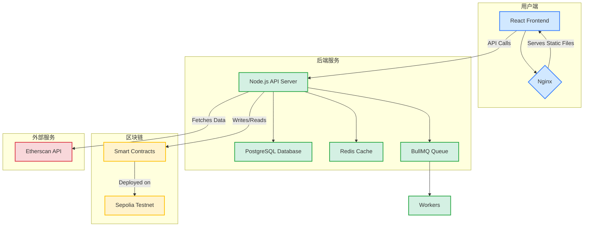

# **Protocol Bank 技术文档 (Technical Documentation)**

**版本:** 1.0
**日期:** 2025年11月11日
**作者:** Manus AI

---

## 1. **系统架构**

Protocol Bank 采用现代化的、前后端分离的单体仓库(monorepo)架构，由三个核心应用和一个共享包组成，部署在云基础设施上。

### 1.1. **架构图**



### 1.2. **组件说明**

| 组件 | 技术栈 | 描述 |
| :--- | :--- | :--- |
| **前端 (Frontend)** | React, Vite, TailwindCSS | 用户交互界面，负责展示数据和发送用户请求。部署为静态文件，由Nginx提供服务。 |
| **后端 (Backend)** | Node.js, Express.js | 处理业务逻辑、用户认证、数据库交互和与区块链的通信。 |
| **数据库 (Database)** | PostgreSQL | 持久化存储用户信息、交易记录、供应商数据等结构化数据。 |
| **缓存 (Cache)** | Redis | 缓存常用数据，如API响应、会话信息，以提高性能。 |
| **任务队列 (Queue)** | BullMQ | 处理异步任务，如发送通知、处理批量支付、执行定时任务等。 |
| **智能合约 (Contracts)** | Solidity, Hardhat | 部署在区块链上(当前为Sepolia)，负责处理资金托管、支付流和批量交易等核心链上逻辑。 |
| **部署 (Deployment)** | AWS EC2, Nginx, PM2 | 前后端应用部署在AWS EC2服务器上，使用Nginx作为反向代理和静态文件服务器，PM2进行Node.js进程管理。 |

---

## 2. **技术栈**

| 类别 | 技术 |
| :--- | :--- |
| **前端** | React 18, Vite, TypeScript, TailwindCSS, Zustand, Ethers.js, Wagmi, D3.js, Recharts, Radix UI, shadcn/ui |
| **后端** | Node.js 20, Express.js, PostgreSQL, Redis, Socket.IO, BullMQ, Ethers.js, JWT |
| **区块链** | Solidity, Hardhat, OpenZeppelin |
| **基础设施** | AWS EC2, RDS, Nginx, PM2, GitHub Actions |

---

## 3. **开发环境设置**

1.  **克隆仓库:**
    ```bash
    git clone https://github.com/everest-an/Protocol-Bank.git
    cd Protocol-Bank
    ```
2.  **安装依赖:**
    ```bash
    pnpm install
    ```
3.  **配置环境变量:**
    ```bash
    cp .env.example .env
    # 编辑 .env 文件，填入数据库、API密钥等配置
    ```
4.  **启动开发服务器:**
    ```bash
    pnpm dev
    ```

---

## 4. **前端架构**

### 4.1. **目录结构**

-   `/src/pages`: 页面级组件，每个文件对应一个路由。
-   `/src/components`: 可重用的UI组件，如按钮、模态框、图表等。
-   `/src/contexts`: React Context，用于全局状态管理 (如 Web3 连接、主题)。
-   `/src/utils`: 工具函数，如API请求、数据格式化、模拟数据生成等。
-   `/src/App.jsx`: 应用主入口，负责路由管理和主布局。

### 4.2. **状态管理**

-   **全局状态:** 使用 `Zustand` 和 React Context (`Web3Context`, `ThemeContext`) 管理全局状态，如用户登录信息、钱包连接状态和UI主题。
-   **组件状态:** 复杂的组件内部状态使用 `useState` 和 `useReducer` 进行管理。

### 4.3. **路由**

-   使用 `window.location.hash` 实现客户端路由，简单高效，无需服务器配置。
-   `App.jsx` 中的 `useEffect` 钩子监听 `hashchange` 事件，并更新 `activeTab` 状态来切换页面组件的渲染。

### 4.4. **Stream Payment 数据流**

Stream Payment 仪表盘的数据获取和渲染流程如下：

1.  **组件挂载:** `StreamPaymentDashboard.jsx` 组件挂载。
2.  **判断登录状态:**
    -   **未登录:** 使用 `useEffect` 钩子调用 `generateFullMockData()` 生成模拟数据，并将其传递给 `EnterprisePaymentNetworkV2` 和其他子组件，用于展示动画和示例。
    -   **已登录:** 从 `Web3Context` 获取用户钱包地址 `account`。
3.  **获取真实数据:**
    -   调用后端API (如 `/api/streams?userAddress={account}`) 获取该用户的所有流式支付数据、统计信息和交易历史。
    -   同时，为了获取实时的链上数据，前端可以直接通过 Ethers.js 与 `JsonRpcProvider` 交互，或通过后端API代理调用 Etherscan API，查询与用户地址相关的交易。
4.  **数据处理与渲染:**
    -   **统计卡片:** API返回的统计数据直接渲染到卡片组件中。
    -   **支付网络图:** 将API返回的支付关系数据转换成 `D3.js` 或 `Recharts` 需要的节点(nodes)和边(edges)格式。节点的颜色根据支付状态(成功/失败/停止)进行设置。交易的橙色粒子动画通过定时更新数据并重绘图表实现。
    -   **交易历史列表:** 将API返回的交易数据直接传递给 `ResponsiveTable` 组件进行渲染。TX HASH列的链接动态生成，指向 `https://sepolia.etherscan.io/tx/{txHash}`。

---

## 5. **后端架构**

### 5.1. **API 设计**

-   采用 RESTful API 设计风格。
-   `server.js` 是应用主入口，负责启动Express服务器、加载中间件和路由。
-   `/src/routes`: 定义API路由，每个文件对应一个业务模块(如 `streamPaymentRoutes.js`)。
-   `/src/controllers`: 处理具体的业务逻辑，由路由层调用。
-   `/src/services`: 封装与外部服务(如数据库、区块链、第三方API)的交互逻辑。
-   `/src/middleware`: Express中间件，如用户认证 (`authMiddleware.js`)。

### 5.2. **数据库**

-   **Schema:** 数据库表结构定义在 `infrastructure/db/schema.sql` (如果存在) 或通过ORM模型隐式定义。
-   **交互:** 使用 `pg` 库直接执行原生SQL查询，以获得最佳性能和灵活性。数据库连接配置在 `/src/config/database.js` 中。

### 5.3. **异步任务**

-   使用 `BullMQ` 和 Redis 来管理后台任务队列。
-   `/src/workers`: 定义任务的处理器(Processor)，如 `streamPaymentWorker.js` 可能负责在支付流的生命周期内定时执行检查和资金转移的链上调用。

---

## 6. **智能合约**

### 6.1. **核心合约**

-   **`StreamPayment.sol`:** (假设) 负责创建和管理单个流式支付的核心逻辑。
-   **`BatchStream.sol`:** (已部署) 负责批量创建流式支付的合约，通过循环调用 `StreamPayment.sol` 的创建函数并优化存储来节省Gas。
-   **合约地址 (Sepolia):** `0x642B0c309358D083EE83748b4C22572aa28AebF7`

### 6.2. **开发与部署**

-   **框架:** 使用 `Hardhat` 进行合约的编译、测试和部署。
-   **部署脚本:** 位于 `/scripts/deploy` 目录下，使用 `hardhat-deploy` 插件进行确定性部署。
-   **部署流程:**
    1.  在 `.env` 文件中配置 `SEPOLIA_RPC_URL` 和 `PRIVATE_KEY`。
    2.  运行 `pnpm hardhat compile` 编译合约。
    3.  运行 `pnpm hardhat run scripts/deploy/deploy-batch-stream.js --network sepolia` 将合约部署到Sepolia测试网。

---

## 7. **部署与运维**

### 7.1. **部署流程**

1.  **代码同步:** 将本地开发完成并测试通过的代码推送到GitHub主分支。
2.  **CI/CD (GitHub Actions):**
    -   GitHub Actions被触发，自动连接到AWS EC2服务器。
    -   在服务器上执行 `git pull` 拉取最新代码。
    -   执行 `pnpm install` 安装依赖。
3.  **前端构建:**
    -   运行 `pnpm build:frontend` 构建生产版本的前端静态文件，输出到 `/apps/frontend/dist`。
4.  **后端重启:**
    -   使用 `pm2 reload api` 或类似命令平滑重启Node.js后端服务，以加载最新的代码。
5.  **Nginx:** Nginx配置无需更改，它会继续作为反向代理指向 `pm2` 管理的Node.js进程，并提供 `/apps/frontend/dist` 目录下的静态文件服务。

### 7.2. **监控**

-   **应用日志:** 使用 `pm2 logs` 查看实时应用日志。
-   **服务器监控:** 使用AWS CloudWatch监控EC2实例的CPU、内存和网络使用情况。
-   **服务可用性:** 配置外部监控服务(如UptimeRobot)定期检查网站和API的可用性。
